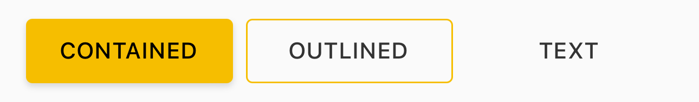
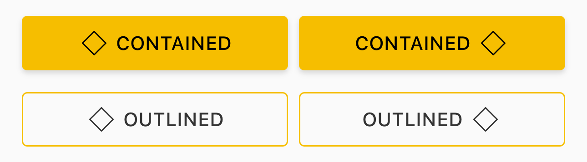
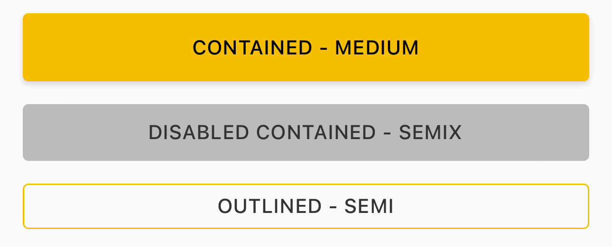
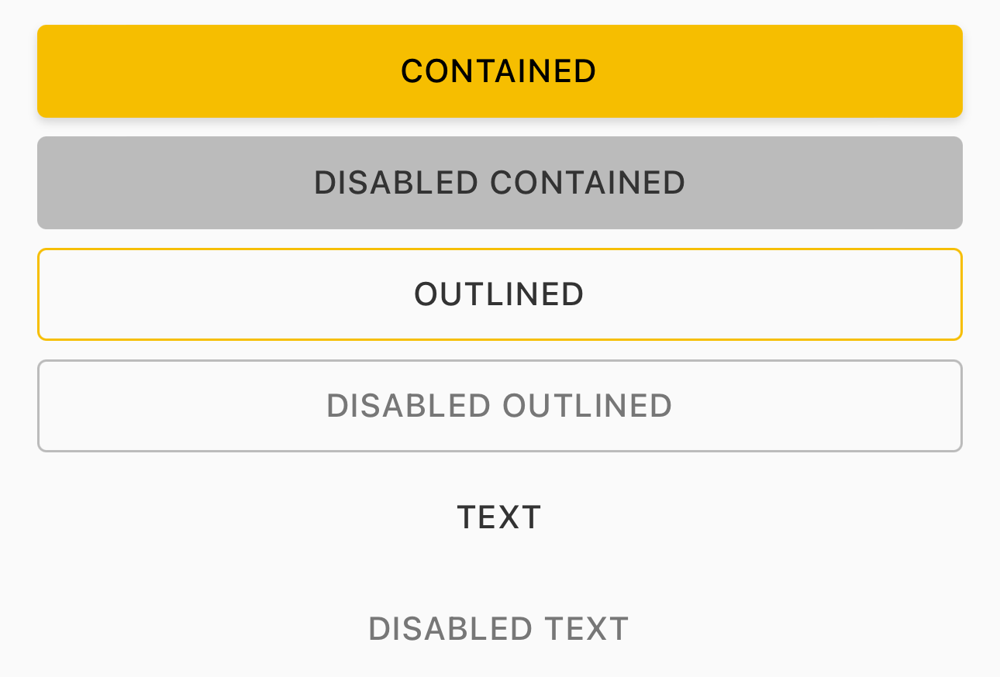
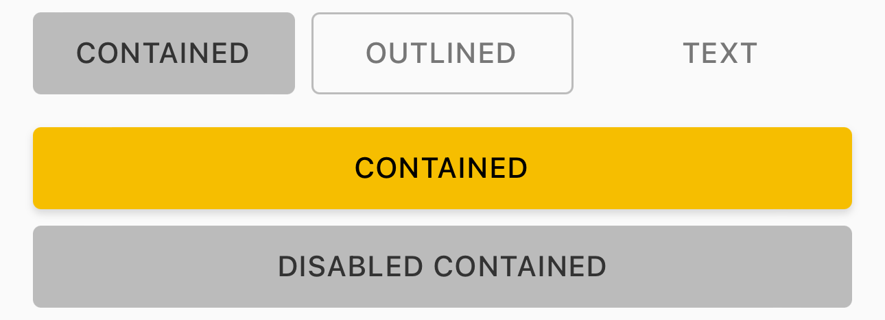
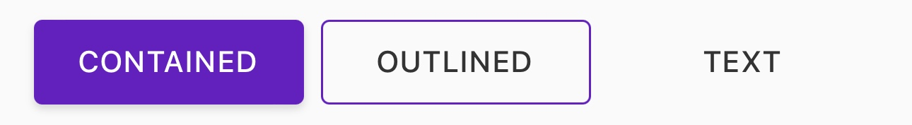

# Button

> Buttons allow users to take actions, and make choices, with a single tap.


## Propertys

| Property       | Property       | Values                    | Status            |
| -------------- | -------------- | ------------------------- | ----------------- |
| Contained      | Style          | Contained, Outlined, Text | ✅  Available      |
| Contained      | Icon           | None, Right, Left         | ✅  Available      |
| Contained      | Size           | Small, Medium, Large      | ✅  Available      |
| Contained      | IsEnabled      | True, False               | ✅  Available      |
| Contained      | Display        | True, False               | ❌  Not Applicable |
| Contained      | Text-Transform | Uppercase, Capitalize     | 🛠️  Not Available  |
| Contained      | Theme          | All Themes Available      | ✅  Available      |


## Technical Usages Examples

> All codes are available for Swift.


#### STYLE - Contained, Outlined, Text



```swift
private let containedButton: NatButton = {
    let button = NatButton(style: .contained)
    button.configure(title: "Contained")
    button.translatesAutoresizingMaskIntoConstraints = false
        
    return button
}()

private let outlinedButton: NatButton = {
    let button = NatButton(style: .outlined)
    button.configure(title: "Outlined")
    button.translatesAutoresizingMaskIntoConstraints = false

    return button
}()

private let textButton: NatButton = {
    let button = NatButton(style: .text, theme: .avonLight)
    button.configure(title: "Text")
    button.translatesAutoresizingMaskIntoConstraints = false

    return button
}()
```


#### ICON - None, Right, Left



```swift
private let containedIconRightButton: NatButton = {
    let button = NatButton(style: .contained)
    button.configure(title: "Contained")
    button.configure(icon: nil, position: .right)
    button.translatesAutoresizingMaskIntoConstraints = false
    return button
}()

private let containedIconLeftButton: NatButton = {
    let button = NatButton(style: .contained)
    button.configure(title: "Contained")
    button.configure(icon: nil, position: .left)
    button.translatesAutoresizingMaskIntoConstraints = false
    return button
}()
```


#### SIZE - Small, Medium, Large



```swift
private let containedFullMediumButton: NatButton = {
    let button = NatButton(style: .contained, size: .medium)
    button.configure(title: "Contained - Medium")
    button.translatesAutoresizingMaskIntoConstraints = false
    return button
}()

private let disableContainedFullSemixButton: NatButton = {
    let button = NatButton(style: .contained, size: .semix)
    button.configure(title: "Disabled Contained - Semix")
    button.isEnabled = false
    button.translatesAutoresizingMaskIntoConstraints = false
    return button
}()

private let outlinedFullSemiButton: NatButton = {
    let button = NatButton(style: .outlined, size: .semi)
    button.configure(title: "Outlined - Semi")
    button.translatesAutoresizingMaskIntoConstraints = false
    return button
}()
```


#### ISENABLED - True, False



```swift
let button = NatButton(style: .contained)
button.isEnabled = false

let button = NatButton(style: .outlined)
button.isEnabled = false

let button = NatButton(style: .text)
button.isEnabled = false
```


#### DISPLAY - True, False

> This property is not from NatButton but is a property related to contained layout. 




#### TEXT-TRANSFORM - Uppercase, Capitalize

🛠️ Not Available 


#### THEME - All DS Themes

> Exemple is used in Natura but theme is for Avon.




```swift
let button = NatButton(style: .contained, theme: .avonLight)
button.configure(title: "Contained")

let button = NatButton(style: .outlined, theme: .avonLight)
button.configure(title: "Outlined")

let button = NatButton(style: .text, theme: .avonLight)
button.configure(title: "Text")
```


## More code
You can check out more examples from SampleApp by clicking [here](https://github.com/natura-cosmeticos/natds-ios/blob/master/SampleApp/Sources/Sample/Components/Button/ButtonsItemViewController.swift).
