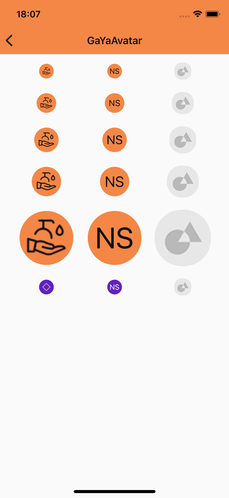
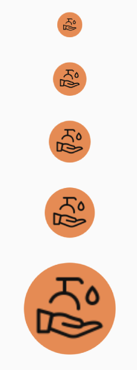
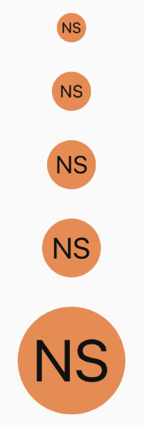

# Guia de Uso - GaYaAvatar

> 📢 O GaYaAvatar faz parte da evolução contínua de componentes do GaYa Design System. Ele foi lançado como um novo componente mas o antigo NatAvatar permanecerá disponível para uso mas não receberá mais atualizações ou suporte ativo. Encorajamos a migração para o GaYaAvatar o quanto antes para aproveitar as melhorias e garantir compatibilidade futura.


## Visão Geral

O componente `GaYaAvatar`  é um componente que permite adicionar imagens ou identificação de pessoas e perfis em aplicativos.

| Prop Figma       | Prop Swift       | Valores                    | Status            |
| -------------- | -------------- | ------------------------- | ----------------- |
| type          | configure          | Icon, Label, Image | ✅  Disponível       |
| size          | size          | Standard, Semi, Semix, Medium, Large | ✅  Disponível       |
| -          | theme          | Todos os temas disponíveis      | ✅  Disponível       |

### Changelog

Para acompanhar a evolução deste e de outros componentes acesse: https://github.com/natura-cosmeticos/natds-ios/blob/master/CHANGELOG.md

### Como Usar

Para começar a usar o `GaYaAvatar`, siga as instruções abaixo para configurar os diferentes estilos e funcionalidades.

<p align="center">
   
</p>

## Estilos

**1. Icon**

<p align="center">
   
</p>

   - **Descrição**: Utilize um ícone disponível na biblioteca de ícones  
   - **Código**:
     ```swift
     let avatar = GaYaAvatar(size: standard)
     avatar.configure(icon: getIcon(.outlinedDefaultMockup))
     ```

**2. Label**

<p align="center">
   
</p>

   - **Descrição**: Exibe a sigla correspondente a string
   - **Código**:
     ```swift
     let avatar = GaYaAvatar(size: .semix)
     avatar.configure(name: "Design System")
     ```

**3. Image**

<p align="center">
   
</p>

   - **Descrição**: Coloque seus próprios resources no formato avatar
   - **Código**:
     ```swift
     let avatar = GaYaAvatar(size: .large)
     avatar.configure(image: UIImage(named: "ImageAreaPlaceholder"))
     ```

## Tamanho

**Tamanhos Disponíveis**

<p align="center">
   
</p>

   - **Standard, Semi, Semix, Medium, Large**
     - Ajuste o tamanho para adequar-se ao contexto de uso.
     
     ```swift
     
     let avatar = GaYaAvatar(size: .standard)

     let avatar = GaYaAvatar(size: .semi)

     let avatar = GaYaAvatar(size: .semix)
     
     let avatar = GaYaAvatar(size: .medium)
          
     let avatar = GaYaAvatar(size: .large)
     
     ```

## Temas

**Aplicando Temas**

<p align="center">
   
</p>

   - **Descrição**: Customize o tema do avatar para corresponder ao flavor visual do seu app.
   - **Exemplo**:
   
     ```swift
     
     let avatar = GaYaAvatar(size: .standard, theme: .avonLight)
     
     ```
