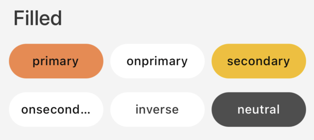
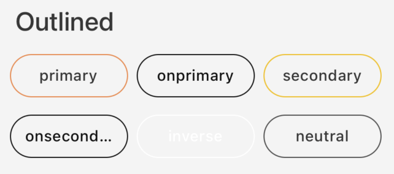
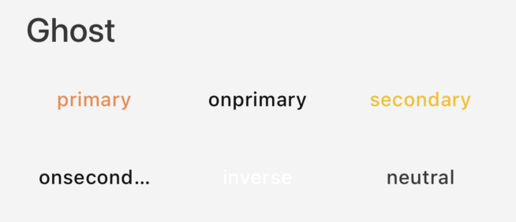
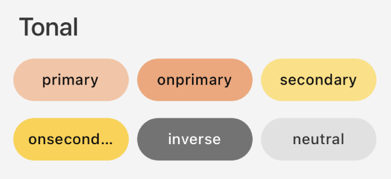
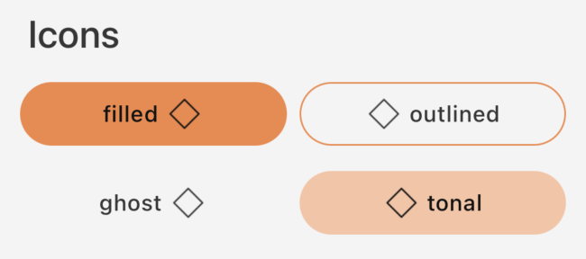
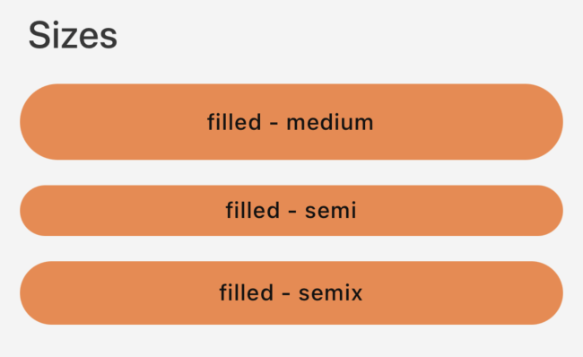
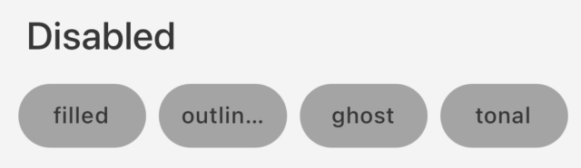

# Guia de Uso - GaYaButton

## Visão Geral

O componente `GaYaButton` é essencial para interações no aplicativo, permitindo que os usuários façam escolhas e executem ações com um simples toque. Este guia detalha as configurações disponíveis para personalizar o botão de acordo com as necessidades do seu design de interface.

| Prop Figma       | Prop Swift       | Valores                    | Status            |
| -------------- | -------------- | ------------------------- | ----------------- |
| Variants          | Style          | Filled, Outlined, Ghost, Tonal | ✅  Disponível       |
| Colors          | Color          | Primary, OnPrimary, Secondary, OnSecondary, Inverse, Neutral | ✅  Disponível       |
| Icon          | Icon + Position           | Right, Left         | ✅  Disponível       |
| Sizes          | Size           | Small, Medium, Large      | ✅  Disponível       |
| Disabled          | IsEnabled      | True, False               | ✅  Disponível       |
| Display          | -        | -               | ❌  Não aplicável  |
| Text-Transform          | - | Uppercase, Lowercase, Capitalize     | ✅  Aplicável pelo tema  |
| -          | Theme          | Todos os temas disponíveis      | ✅  Disponível       |

### Como Usar

Para começar a usar o `GaYaButton`, siga as instruções abaixo para configurar os diferentes estilos e funcionalidades.

## Estilos de Botão

**1. Filled**

<p align="center">
   
</p>

   - **Descrição**: Botão com fundo colorido.
   - **Código**:
     ```swift
     let filledButton = GaYaButton(style: .filled)
     filledButton.configure(title: "Filled")
     ```

**2. Outlined**

<p align="center">
   
</p>

   - **Descrição**: Botão com borda e fundo transparente.
   - **Código**:
     ```swift
     let outlinedButton = GaYaButton(style: .outlined)
     outlinedButton.configure(title: "Outlined")
     ```

**3. Ghost**

<p align="center">
   
</p>

   - **Descrição**: Botão sem borda ou fundo, apenas texto.
   - **Código**:
     ```swift
     let textButton = GaYaButton(style: .ghost)
     textButton.configure(title: "Ghost")
     ```
     
**4. Tonal**

<p align="center">
   
</p>

   - **Descrição**: Botão com fundo colorido, cores mais claras.
   - **Código**:
     ```swift
     let tonalButton = GaYaButton(style: .tonal)
     tonalButton.configure(title: "Tonal")
     ```

## Cores

**1. Primary**
   - **Código**:
     ```swift
     button.configure(color: .primary)
     ```

**2. OnPrimary**
   - **Código**:
     ```swift
     button.configure(color: .onPrimary)
     ```

**3. Secondary**
   - **Código**:
     ```swift
     button.configure(color: .secondary)
     ```
     
**4. OnSecondary**
   - **Código**:
     ```swift
     button.configure(color: .onSecondary)
     ```

**4. Inverse**
   - **Código**:
     ```swift
     button.configure(color: .inverse)
     ```

**4. Neutral**
   - **Código**:
     ```swift
     button.configure(color: .neutral)
     ```

## Ícones

**Posicionamento de Ícones**

<p align="center">
   
</p>

   - **Descrição**: Adicione ícones ao botão para melhorar a identificação visual.
   - **À Direita**:
     ```swift
     let button = GaYaButton(style: .filled)
     button.configure(icon: getIcon(.outlinedAlertNotification), position: .right)
     ```
   - **À Esquerda**:
     ```swift
     let button = GaYaButton(style: .filled)
     button.configure(icon: getIcon(.outlinedAlertNotification), position: .left)
     ```

## Tamanho, Ativação, Posicionamento e Text-transform

**Tamanhos Disponíveis**

<p align="center">
   
</p>

   - **Semi, Semix e Medium**
     - Ajuste o tamanho para adequar-se ao contexto de uso.
     
     ```swift
     let button = GaYaButton(style: .filled, size: .medium)
     button.configure(title: "Filled - Medium")

     let button = GaYaButton(style: .filled, size: .semix)
     button.configure(title: "Filled - Semix")

     let button = GaYaButton(style: .outlined, size: .semi)
     button.configure(title: "Outlined - Semi")
     

**Ativação**

<p align="center">
   
</p>

   - **Habilitar/Desabilitar Botão**
     - Gerencie se o botão pode ser interagido pelo usuário.
     
     ```swift
     let disabledButton = GaYaButton(style: .filled)
     disabledButton.isEnabled = false
     disabledButton.configure(title: "Desabilitado")
     ```

**Posicionamento (não aplicável)**
   - **Display**
     - O posicionamento obedece a arquitetura da tela utilizada e hierarquia dos componentes existentes.
    
**Text-transform (não aplicável)**
   - **Uppercase, Lowercase, Capitalize**
     - Gerenciado pelo tema, a propriedade está sendo modificada diretamente pelo tema utilizado
     

## Temas

**Aplicando Temas**
   - **Descrição**: Customize o tema do botão para corresponder ao flavor visual do seu app.
   - **Exemplo**:
     ```swift
     let themeButton = GaYaButton(style: .filled, theme: .avonLight)
     themeButton.configure(title: "Tema Avon")
     ```

