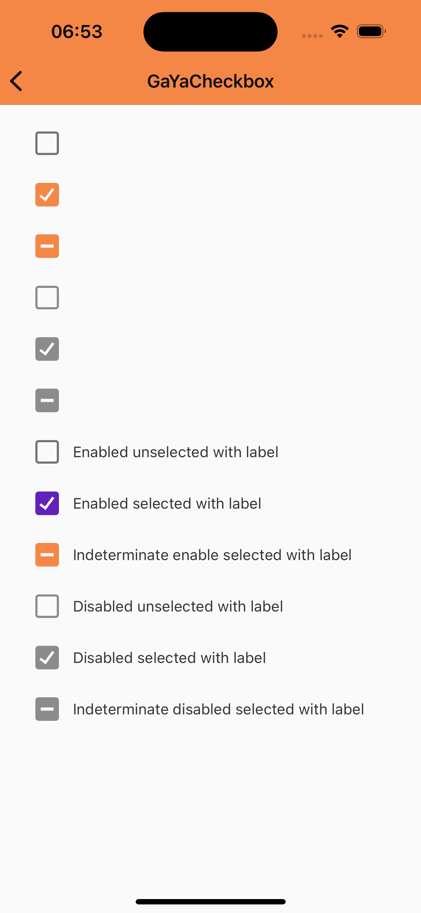

# GaYaCheckbox

> 📢 O GaYaCheckbox faz parte da evolução contínua de componentes do GaYa Design System. Ele foi lançado como um novo componente mas o antigo NatCheckbox permanecerá disponível para uso mas não receberá mais atualizações ou suporte ativo. Encorajamos a migração para o GaYaCheckbox o quanto antes para aproveitar as melhorias e garantir compatibilidade futura.


## Propriedades

GaYaCheckbox permite que os usuários selecionem um ou mais itens de um conjunto. Checkboxes podem ativar ou desativar uma opção.

| Propriedade           | Valores                         | Status            |
| --------------     | -------------------------      | ----------------- |
| isSelected, isIndeterminate             | Checked, Unchecked, Indeterminate                   | ✅  Disponível     |
| -          | Enabled, Pressed   | ✅  Disponível     |
| isEnabled         | True ou False        | ✅  Disponível     |


## Guia de Uso

<p align="center">
   
</p>

<br>

```swift
    private let enabledUnselectedCheckbox: GaYaCheckbox = {
        let checkbox = GaYaCheckbox()
        checkbox.translatesAutoresizingMaskIntoConstraints = false

        return checkbox
    }()

    private let enabledSelectedCheckbox: GaYaCheckbox = {
        let checkbox = GaYaCheckbox()
        checkbox.configure(isSelected: true)
        checkbox.translatesAutoresizingMaskIntoConstraints = false

        return checkbox
    }()

    private let indeterminateEnabledSelectedCheckbox: GaYaCheckbox = {
        let checkbox = GaYaCheckbox()
        checkbox.configure(isSelected: true)
        checkbox.configure(isIndeterminate: true)
        checkbox.translatesAutoresizingMaskIntoConstraints = false

        return checkbox
    }()

    private let disabledUnselectedCheckbox: GaYaCheckbox = {
        let checkbox = GaYaCheckbox()
        checkbox.configure(isSelected: false)
        checkbox.configure(isEnabled: false)
        checkbox.translatesAutoresizingMaskIntoConstraints = false

        return checkbox
    }()

    private let disabledSelectedCheckbox: GaYaCheckbox = {
        let checkbox = GaYaCheckbox()
        checkbox.configure(isSelected: true)
        checkbox.configure(isEnabled: false)
        checkbox.translatesAutoresizingMaskIntoConstraints = false

        return checkbox
    }()

    private let indeterminateDisabledSelectedCheckbox: GaYaCheckbox = {
        let checkbox = GaYaCheckbox()
        checkbox.configure(isSelected: true)
        checkbox.configure(isEnabled: false)
        checkbox.configure(isIndeterminate: true)
        checkbox.translatesAutoresizingMaskIntoConstraints = false

        return checkbox
    }()

    private let enabledUnselectedLabelCheckbox: GaYaCheckbox = {
        let checkbox = GaYaCheckbox(theme: .avonLight)
        checkbox.configure(text: "Enabled unselected with label")
        checkbox.translatesAutoresizingMaskIntoConstraints = false

        return checkbox
    }()

    private let enabledSelectedLabelCheckbox: GaYaCheckbox = {
        let checkbox = GaYaCheckbox(theme: .avonLight)
        checkbox.configure(isSelected: true)
        checkbox.configure(text: "Enabled selected with label")
        checkbox.translatesAutoresizingMaskIntoConstraints = false

        return checkbox
    }()

    private let disabledUnselectedLabelCheckbox: GaYaCheckbox = {
        let checkbox = GaYaCheckbox()
        checkbox.configure(isSelected: false)
        checkbox.configure(isEnabled: false)
        checkbox.configure(isIndeterminate: true)
        checkbox.configure(text: "Disabled unselected with label")
        checkbox.translatesAutoresizingMaskIntoConstraints = false

        return checkbox
    }()

    private let disabledSelectedLabelCheckbox: GaYaCheckbox = {
        let checkbox = GaYaCheckbox()
        checkbox.configure(isSelected: true)
        checkbox.configure(isEnabled: false)
        checkbox.configure(text: "Disabled selected with label")
        checkbox.translatesAutoresizingMaskIntoConstraints = false

        return checkbox
    }()

    private let indeterminateEnableSelectedLabelCheckbox: GaYaCheckbox = {
        let checkbox = GaYaCheckbox()
        checkbox.configure(isSelected: true)
        checkbox.configure(isEnabled: true)
        checkbox.configure(text: "Indeterminate enable selected with label")
        checkbox.configure(isIndeterminate: true)
        checkbox.translatesAutoresizingMaskIntoConstraints = false

        return checkbox
    }()

    // swiftlint:disable:next identifier_name
    private let indeterminateDisabledSelectedLabelCheckbox: GaYaCheckbox = {
        let checkbox = GaYaCheckbox()
        checkbox.configure(isSelected: true)
        checkbox.configure(isEnabled: false)
        checkbox.configure(text: "Indeterminate disabled selected with label")
        checkbox.configure(isIndeterminate: true)
        checkbox.translatesAutoresizingMaskIntoConstraints = false

        return checkbox
    }()
```
