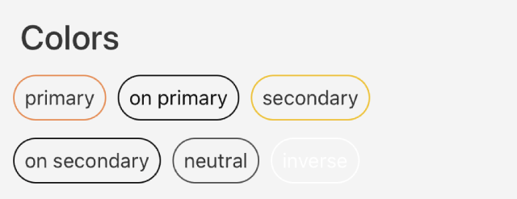
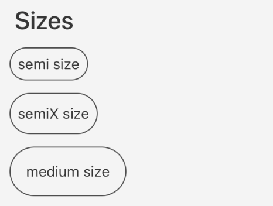
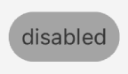
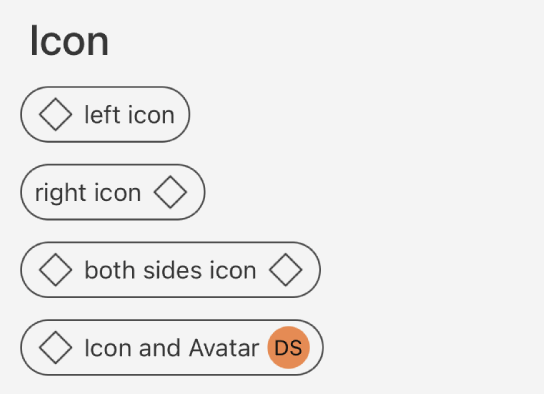
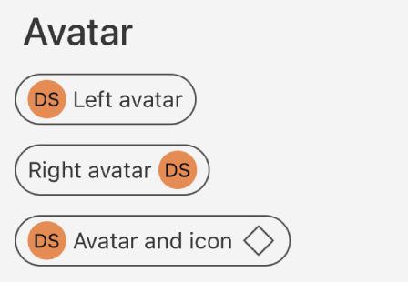

# Guia de Uso - GaYaChipFilter

> 📢 O GaYaChipFilter faz parte da evolução contínua de componentes do GaYa Design System. Ele foi lançado como um novo componente mas o antigo NatChipFilter permanecerá disponível para uso mas não receberá mais atualizações ou suporte ativo. Encorajamos a migração para o GaYaChipFilter o quanto antes para aproveitar as melhorias e garantir compatibilidade futura.

## GaYaChip x GaYaChipFilter

O componente `GaYaChipFilter` precisa responder instantaneamente ao toque do usuário. Para isso, usamos o UILongPressGestureRecognizer com minimumPressDuration definido como zero. Esse componente é ideal para cenários onde uma resposta imediata ao toque é crucial. No contexto de um UIScrollView horizontal, isso permite que os usuários possam selecionar um chip sem interferir na rolagem horizontal.

```swift
let tapGesture = UILongPressGestureRecognizer(target: self, action: #selector(tapHandler(gesture:)))
tapGesture.minimumPressDuration = .zero
view.addGestureRecognizer(tapGesture)
```

## Visão Geral

O componente `GaYaChipFilter` permite que os usuários insiram informações, façam seleções, filtrem conteúdo ou acionem ações. Enquanto botões são esperados aparecer de forma consistente e com chamadas para ação familiares, os chips devem aparecer dinamicamente como um grupo de múltiplos elementos interativos.


| Prop Figma       | Prop Swift       | Valores                    | Status            |
| -------------- | -------------- | ------------------------- | ----------------- |
| Colors          | Color          | Primary, OnPrimary, Secondary, OnSecondary, Inverse, Neutral | ✅  Disponível       |
| Size          | Size           | Small, Medium, Large      | ✅  Disponível       |
| Disabled          | State      | Disabled               | ✅  Disponível       |
| State          | State           | Normal, Selected         | ✅  Disponível       |
| Helper before          | Position          | Left | ✅  Disponível       |
| Helper after          | Position        | Right               | ✅  Disponível   |
| Label          | Text | -     | ✅  Disponível  |
| Helper type          | - | Icon, Avatar     | ✅  Disponível  |
| -          | Theme          | Todos os temas disponíveis      | ✅  Disponível       |

### Changelog

Para acompanhar a evolução deste e de outros componentes acesse: https://github.com/natura-cosmeticos/natds-ios/blob/master/CHANGELOG.md

### Como Usar

Para começar a usar o `GaYaChipFilter`, siga as instruções abaixo para configurar os diferentes estilos e funcionalidades.


## Cores

<p align="center">
   
</p>

**Primary**

  ```swift
  let chip = GaYaChipFilter(color: .primary)
  ```

**OnPrimary**

  ```swift
  let chip = GaYaChipFilter(color: .onPrimary)
  ```

**Secondary**
  ```swift
  let chip = GaYaChipFilter(color: .secondary)
  ```
     
**OnSecondary**
  ```swift
  let chip = GaYaChipFilter(color: .onSecondary)
  ```

**Inverse**
  ```swift
  let chip = GaYaChipFilter(color: .inverse)
  ```

**Neutral**
  ```swift
  let chip = GaYaChipFilter(color: .neutral)
  ```

## Tamanho, Ativação e Estado

**Tamanhos Disponíveis**

<p align="center">
   
</p>

 
 - **Semi, Semix e Medium**
     
     ```swift
     let chip = GaYaChipFilter(size: .semi, color: .primary)

     let chip = GaYaChipFilter(size: .semiX, color: .primary)

     let chip = GaYaChipFilter(size: .medium, color: .primary)
     ```

**Ativação**

<p align="left">
   
</p>

   - **Habilitar/Desabilitar Chip**
     
     ```swift
     let chip = GaYaChipFilter(color: .primary)
     chip.configure(state: .disabled)
     ```

**Estado**

- **Normal, Selected**
     
     ```swift
     let chip = GaYaChipFilter(color: .primary)
     chip.configure(state: .normal)
        
     let chip = GaYaChipFilter(color: .primary)
     chip.configure(state: .selected)
     ```
     
## Helpers

**Icon**

<p align="center">
   
</p>

   - **À Direita**:
     ```swift
     let icon = getIcon(.outlinedDefaultMockup)
     let chip = GaYaChipFilter()
     chip.configure(icon: icon, position: .right)
     ```
   - **À Esquerda**:
     ```swift
     let icon = getIcon(.outlinedDefaultMockup)
     let chip = GaYaChipFilter()
     chip.configure(icon: icon, position: .left)
     ```

**Avatar**

<p align="center">
   
</p>

   - **À Direita**:
     ```swift
     let avatar = GaYaAvatar(size: .standard, type: .label)
     avatar.configure(name: "Design System")
     let chip = GaYaChipFilter()
     chip.configure(avatar: avatar, position: .right)
     ```
   - **À Esquerda**:
     ```swift
     let avatar = GaYaAvatar(size: .standard, type: .label)
     avatar.configure(name: "Design System")
     let chip = GaYaChipFilter()
     chip.configure(avatar: avatar, position: .left)
     ```

## Temas

**Aplicando Temas**
   - **Descrição**: Customize o tema do chip para corresponder ao flavor visual do seu app.
     ```swift
     let chip = GaYaChipFilter(color: .primary, theme: .avonv2Light)
     ```
