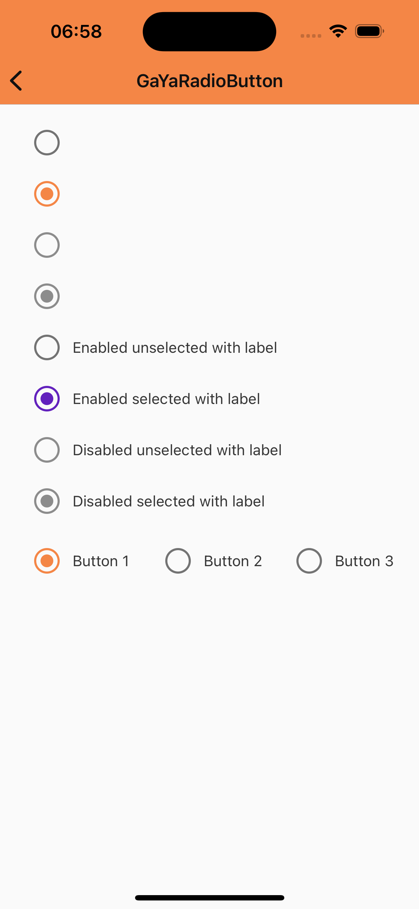

# GaYaRadioButton

> 📢 O GaYaRadioButton faz parte da evolução contínua de componentes do GaYa Design System. Ele foi lançado como um novo componente mas o antigo NatRadioButton permanecerá disponível para uso mas não receberá mais atualizações ou suporte ativo. Encorajamos a migração para o GaYaRadioButton o quanto antes para aproveitar as melhorias e garantir compatibilidade futura.


## Properties

GaYaRadioButton permite que os usuários selecionem uma única opção de um conjunto.

| Propriedade           | Valores                         | Status            |
| --------------     | -------------------------      | ----------------- |
| isSelected         | True ou False                  | ✅  Disponível     |
| isEnabled          | True ou False   | ✅  Disponível     |


## Technical Usages Examples


<p align="center">
   
</p>

```swift
    private let groupFirstRadioButton: GaYaRadioButton = {
        let radioButton = GaYaRadioButton()
        radioButton.configure(isSelected: true)
        radioButton.configure(text: "Button 1")
        radioButton.translatesAutoresizingMaskIntoConstraints = false

        return radioButton
    }()

    private let groupSecondRadioButton: GaYaRadioButton = {
        let radioButton = GaYaRadioButton()
        radioButton.configure(text: "Button 2")
        radioButton.translatesAutoresizingMaskIntoConstraints = false

        return radioButton
    }()

    private let groupThirdRadioButton: GaYaRadioButton = {
        let radioButton = GaYaRadioButton()
        radioButton.configure(text: "Button 3")
        radioButton.translatesAutoresizingMaskIntoConstraints = false

        return radioButton
    }()

    private let enabledUnselectedRadioButton: GaYaRadioButton = {
        let radioButton = GaYaRadioButton()
        radioButton.translatesAutoresizingMaskIntoConstraints = false

        return radioButton
    }()

    private let enabledSelectedRadioButton: GaYaRadioButton = {
        let radioButton = GaYaRadioButton()
        radioButton.configure(isSelected: true)
        radioButton.translatesAutoresizingMaskIntoConstraints = false

        return radioButton
    }()

    private let disabledUnselectedRadioButton: GaYaRadioButton = {
        let radioButton = GaYaRadioButton()
        radioButton.configure(isSelected: false)
        radioButton.configure(isEnabled: false)
        radioButton.translatesAutoresizingMaskIntoConstraints = false

        return radioButton
    }()

    private let disabledSelectedRadioButton: GaYaRadioButton = {
        let radioButton = GaYaRadioButton()
        radioButton.configure(isSelected: true)
        radioButton.configure(isEnabled: false)
        radioButton.translatesAutoresizingMaskIntoConstraints = false

        return radioButton
    }()

    private let enabledUnselectedLabelRadioButton: GaYaRadioButton = {
        let radioButton = GaYaRadioButton(theme: .avonLight)
        radioButton.configure(text: "Enabled unselected with label")
        radioButton.translatesAutoresizingMaskIntoConstraints = false

        return radioButton
    }()

    private let enabledSelectedLabelRadioButton: GaYaRadioButton = {

        let radioButton = GaYaRadioButton(theme: .avonLight)
        radioButton.configure(text: "Enabled selected with label")
        radioButton.configure(isSelected: true)
        radioButton.translatesAutoresizingMaskIntoConstraints = false

        return radioButton
    }()

    private let disabledUnselectedLabelRadioButton: GaYaRadioButton = {
        let radioButton = GaYaRadioButton()
        radioButton.configure(text: "Disabled unselected with label")
        radioButton.configure(isSelected: false)
        radioButton.configure(isEnabled: false)
        radioButton.translatesAutoresizingMaskIntoConstraints = false

        return radioButton
    }()

    private let disabledSelectedLabelRadioButton: GaYaRadioButton = {
        let radioButton = GaYaRadioButton()
        radioButton.configure(text: "Disabled selected with label")
        radioButton.configure(isSelected: true)
        radioButton.configure(isEnabled: false)
        radioButton.translatesAutoresizingMaskIntoConstraints = false

        return radioButton
    }()

    private lazy var radioButtonGroup: GaYaRadioButtonGroup = {
        let group = GaYaRadioButtonGroup()
        group.configure(radioButtons: [groupFirstRadioButton, groupSecondRadioButton, groupThirdRadioButton])
        return group
    }()
```
