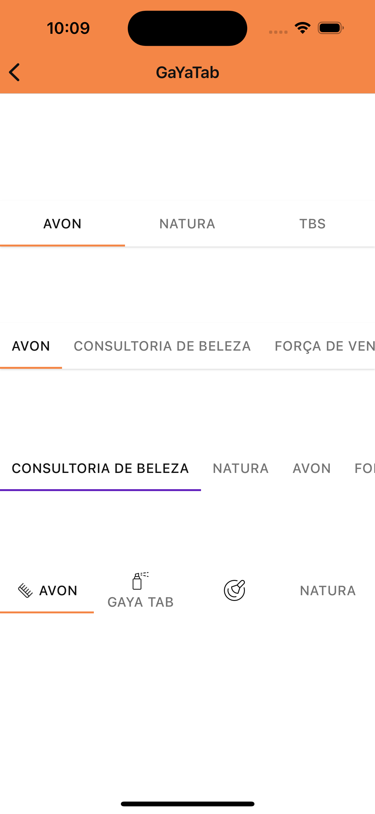

# Guia de Uso - GaYaTab

> 📢 O GaYaTab faz parte da evolução contínua de componentes do GaYa Design System. Ele foi lançado como um novo componente mas o antigo NatTab permanecerá disponível para uso mas não receberá mais atualizações ou suporte ativo. Encorajamos a migração para o GaYaTab o quanto antes para aproveitar as melhorias e garantir compatibilidade futura.


## Visão Geral

O componente `GaYaTab` é essencial para organizar diferentes telas no aplicativo, permitindo que os usuários façam visualizem diferentes dados com um simples toque. Este guia detalha as configurações disponíveis para personalizar o GaYaTab de acordo com as necessidades do seu design de interface.


| Prop Figma       | Prop Swift       | Valores                    | Status            |
| -------------- | -------------- | ------------------------- | ----------------- |
| Position          | position          | fixed, scrollable | ✅  Disponível       |
| Icon          | style          | .iconLeft, .iconTop, iconOnly | ✅  Disponível       |
| Interaction State           | -           | -         | ✅  Disponível       |
| Disabled          | -           | -      | ❌ Não aplicável       |
| Elevation          | Elevation      | true, false               | ✅  Disponível       |
| Color          | -        | -               | ❌ Não aplicável |
| -          | Theme          | Todos os temas disponíveis      | ✅  Disponível       |

### Changelog

Para acompanhar a evolução deste e de outros componentes acesse: https://github.com/natura-cosmeticos/natds-ios/blob/master/CHANGELOG.md

### Como Usar

Para começar a usar o `GaYaTab`, siga as instruções abaixo para configurar os diferentes estilos e funcionalidades.

## Technical Usages Examples

<p align="center">
   
</p>

<br>

```swift
    private let scrollableTab = GaYaTab()
    private let fixedTab = GaYaTab()
    private let scrollableTabWithoutElevation = GaYaTab(theme: .avonLight)
    private let iconTabs = GaYaTab()
    
        // Fixed
        addTab(tab: fixedTab)
        fixedTab.delegate = self
        fixedTab.insertTab(title: "AVON")
        fixedTab.insertTab(title: "NATURA")
        fixedTab.insertTab(title: "TBS")
        fixedTab.configure(position: .fixed)
        fixedTab.configure(elevation: true)
        
        // Scrollable
        addTab(tab: scrollableTab)
        scrollableTab.delegate = self
        scrollableTab.insertTab(title: "AVON")
        scrollableTab.insertTab(title: "CONSULTORIA DE BELEZA")
        scrollableTab.insertTab(title: "FORÇA DE VENDAS")
        scrollableTab.insertTab(title: "NATURA")
        scrollableTab.insertTab(title: "THE BODY SHOP")
        scrollableTab.configure(position: .scrollable)
        scrollableTab.configure(elevation: true)
        
        // ScrollableWithoutElevation
        addTab(tab: scrollableTabWithoutElevation)
        scrollableTabWithoutElevation.delegate = self
        scrollableTabWithoutElevation.insertTab(title: "CONSULTORIA DE BELEZA")
        scrollableTabWithoutElevation.insertTab(title: "NATURA")
        scrollableTabWithoutElevation.insertTab(title: "AVON")
        scrollableTabWithoutElevation.insertTab(title: "FORÇA DE VENDAS")
        scrollableTabWithoutElevation.insertTab(title: "THE BODY SHOP")
        scrollableTabWithoutElevation.configure(position: .scrollable)
        
        // Icon Tabs (exemplos com ícone à esquerda, em cima e sozinho)
        addTab(tab: iconTabs)
        iconTabs.delegate = self
        iconTabs.insertTab(title: "AVON", style: .iconLeft(icon: getIcon(.outlinedProductHair)))
        iconTabs.insertTab(title: "GAYA TAB", style: .iconTop(icon: getIcon(.outlinedProductSpray)))
        iconTabs.insertTab(style: .iconOnly(icon: getIcon(.outlinedProductBlush)))
        iconTabs.insertTab(title: "NATURA")
        iconTabs.configure(position: .fixed)
        
        private func addTab(tab: GaYaTab) {
        stackView.addArrangedSubview(tab)
        tab.translatesAutoresizingMaskIntoConstraints = false

        NSLayoutConstraint.activate([
            tab.leadingAnchor.constraint(equalTo: stackView.leadingAnchor),
            tab.trailingAnchor.constraint(equalTo: stackView.trailingAnchor)
        ])
        }
```
