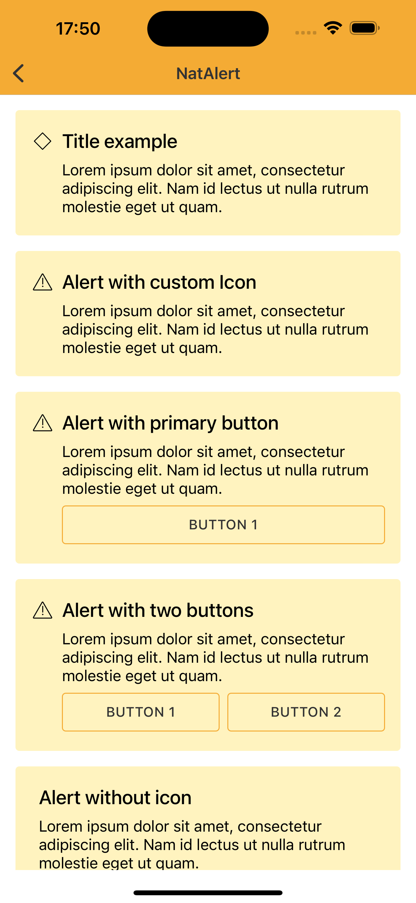
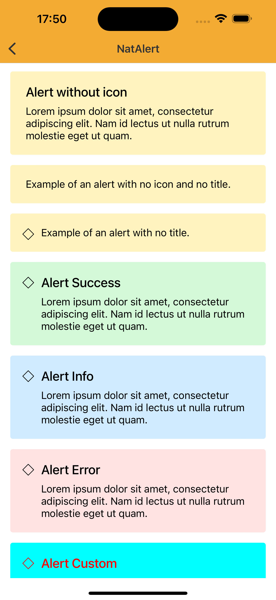
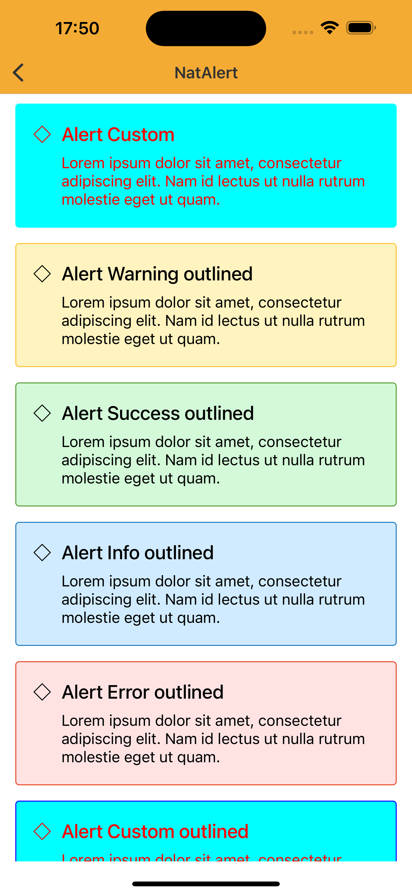
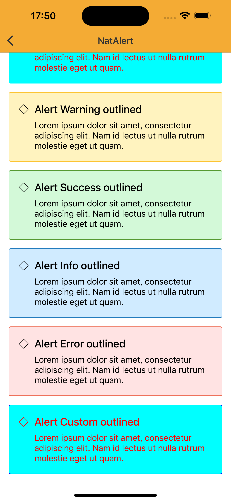

# Alert

### Difference of Snackbar and Alert

#### Alert
Alert is an element within the context of the page (like a disclaimer, a highlighted information box) without interaction.

#### Snackbar
The Snackbar is something temporary about the content of the page (like a notification) that can have the action of dismiss, or a CTA.

<br>


## Properties

| Property           | Values                         | Status            |
| --------------     | -------------------------      | ----------------- |
| Title             | True, False                          | ✅  Available     |
| Icon          | True, False   | ✅  Available     |
| Type         | Contained, Outlined       | ✅  Available     |
| Color          | Success, Warning, Info, Error, Custom                    | ✅  Available     |

<br>

## Technical Usages Examples
> All codes are available for iOS with Swift.

<br>

<p align="center">
   
&nbsp; &nbsp; &nbsp; 
  
&nbsp; &nbsp; &nbsp; 
  
 &nbsp; &nbsp;&nbsp; 
    
</p>

<br>

```swift
private let alert: NatAlert = {
    let alert = NatAlert(style: .warning)
    alert.configure(titleText: "Title example")
    alert.configure(descriptionText: "Lorem ipsum dolor sit amet, consectetur adipiscing elit. Nam
        id lectus ut nulla rutrum molestie eget ut quam.")
    return alert
}()
```

<br><br>

### Title

```swift
alert.configure(titleText: "Alert without icon")
```

### Icon

```swift
alert.configure(icon: getIcon(.outlinedAlertWarning))
```

### Type

```swift
let alert = NatAlert(style: .warning, type: .outlined)
```

<br>
