# App Bar Top

> The top app bar displays information and actions relating to the current screen

<br>

## Properties:

| Property           | Values                         | Status            |
| --------------     | -------------------------      | ----------------- |
| Elevation             | True, False                          | ✅  Available     |
| Color          | Primary, Secondary, Default, Inverse   | ✅  Available     |
| Action Right         | -        | ✅  Available     |
| Action Left         | -        | ✅  Available     |
| Content Position         | Left, Center        | ❌  Not applicable     |
| Content Type         | Text, Media, Search        | ✅  Available     |
| Content Proeminent         | True, False        | 🗂️  Backlog     |
 

<br>
      
## Technical Usages Examples

<br><br>

<p align="center">
  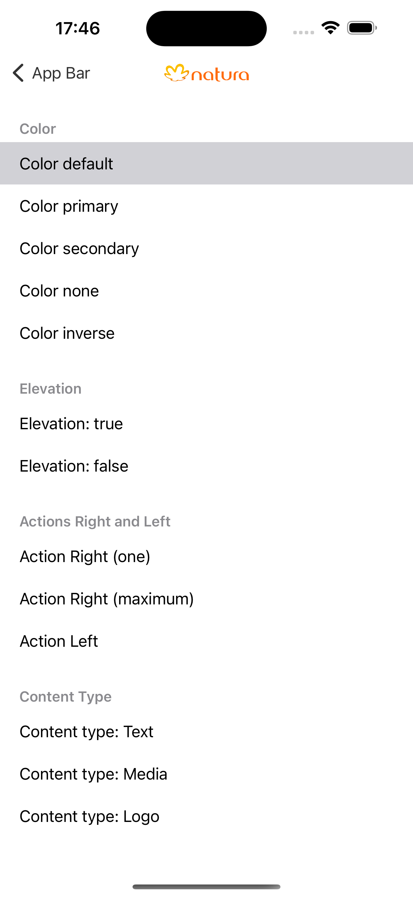 
&nbsp; &nbsp; &nbsp; 
  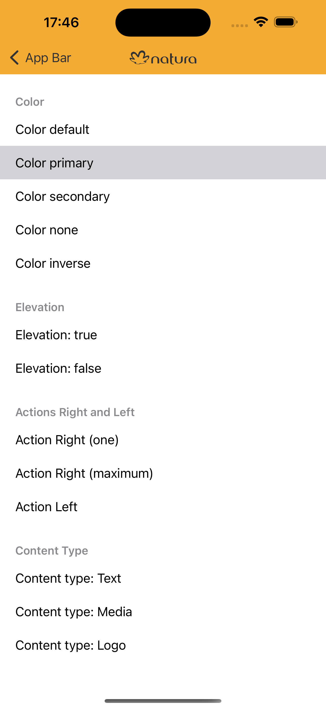
&nbsp; &nbsp; &nbsp; 
  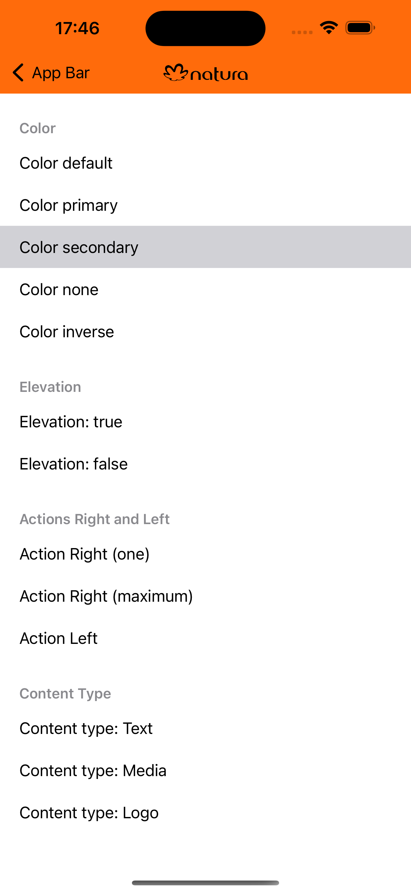
 &nbsp; &nbsp;&nbsp; 
  
</p>
<br>

<p align="center">
  
  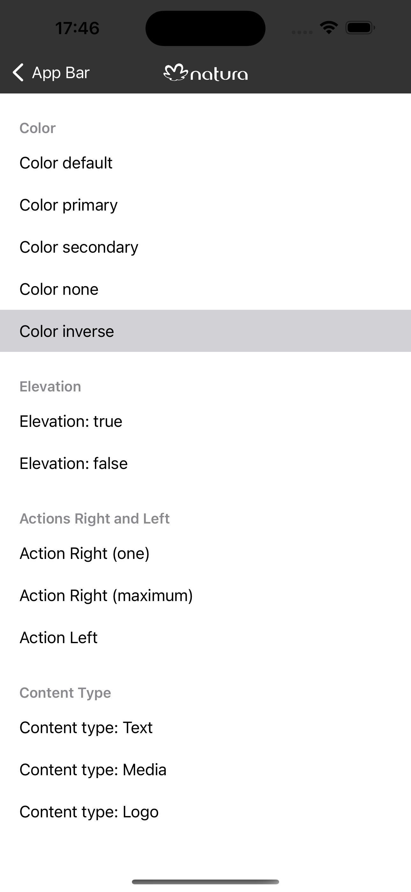
&nbsp; &nbsp; &nbsp; 
  
 &nbsp; &nbsp;&nbsp; 
 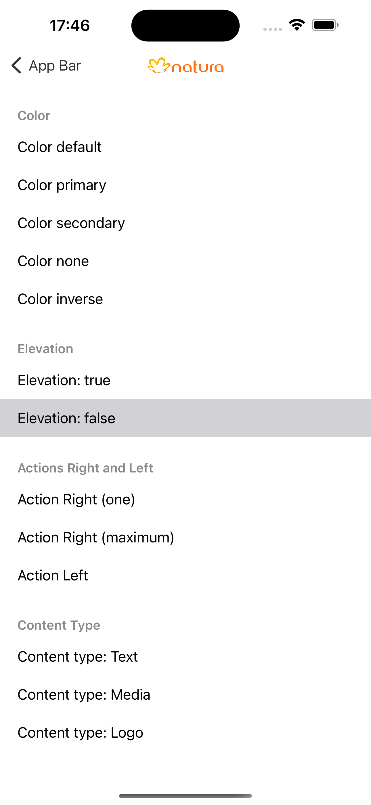 
&nbsp; &nbsp; &nbsp; 
  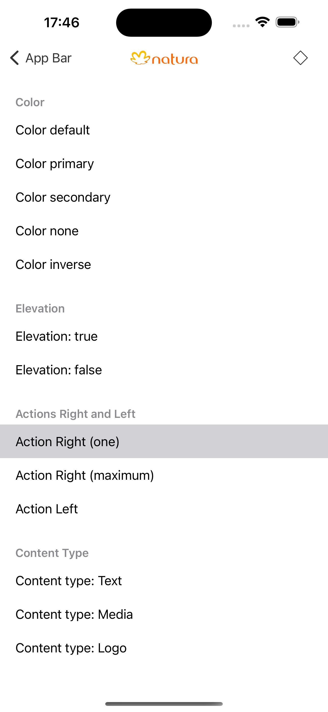
</p>
<br>
<p align="center">
  
  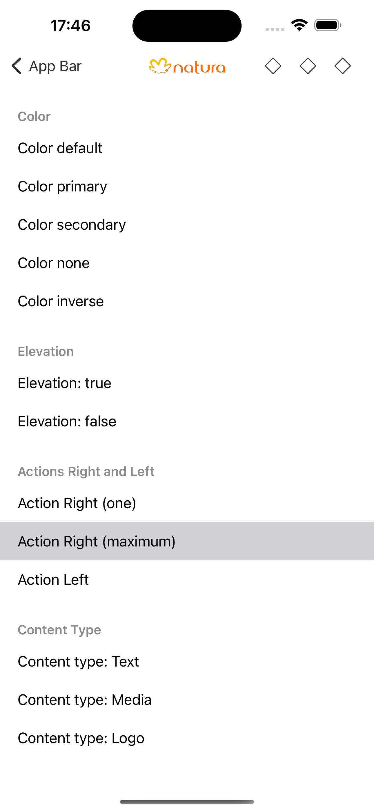
  &nbsp; &nbsp;&nbsp; 
  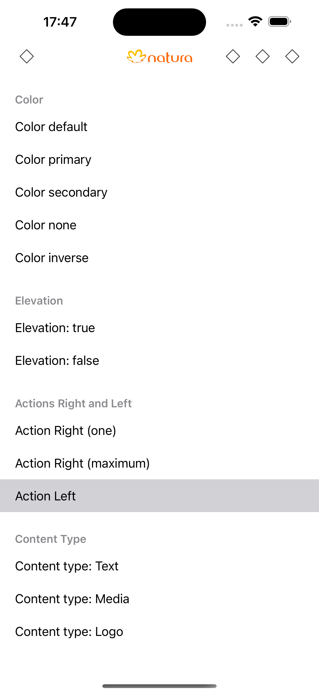 
&nbsp; &nbsp; &nbsp; 
  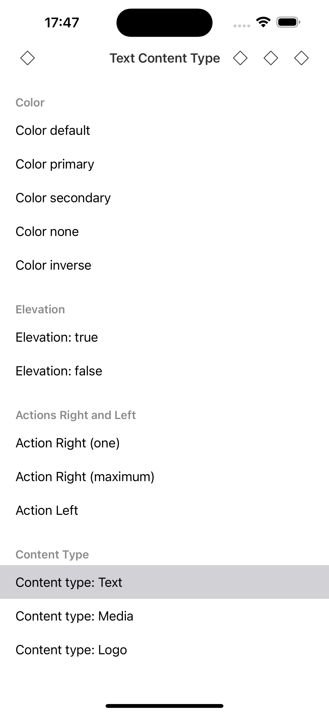
  &nbsp; &nbsp;&nbsp; 
 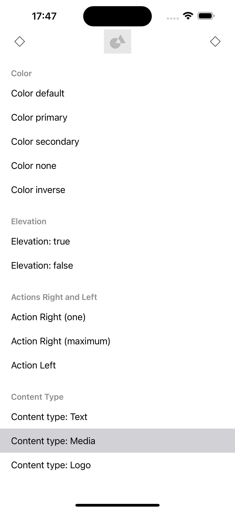 
</p>
<br>
<p align="center">
  
  &nbsp; &nbsp;&nbsp; 
  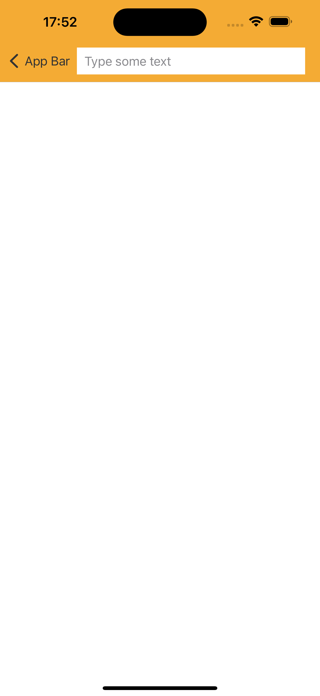 
</p>

<br>

### How to use it?

```swift
self.navigationController?.configure(appBarColor: .default, appBarContentType: .colorLogo)
self.navigationController?.configure(color: .primary)
self.navigationController?.configure(elevation: true)
self.configure(actionRight: [iconButton, customView])
self.configure(actionLeft: iconButton)
```
