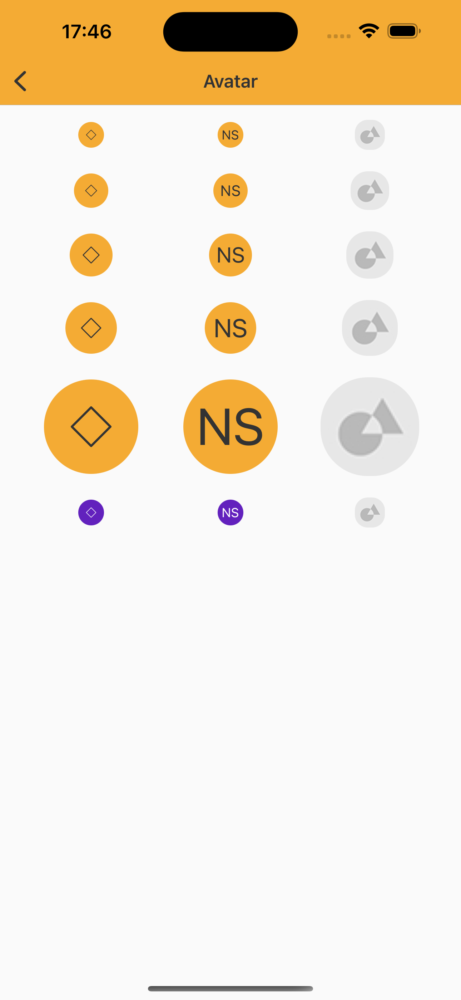

# Avatar

> Avatar is a component that allows you to add images or identification of people and profiles in applications.  

<br>

## Properties:

| Property           | Values                         | Status            |
| --------------     | -------------------------      | ----------------- |
| Size             | Standard, Semi, Semix, Medium, Large                         | ✅  Available     |
| Type          | Icon, Label, Image   | ✅  Available     |
| Fallback         | Icon, Label       | ✅  Available     |

<br>
      
## Technical Usages Examples




```swift
let avatar = NatAvatar(size: .standard)
avatar.configure(image: UIImage(named: "ImageAreaPlaceholder"))
```
