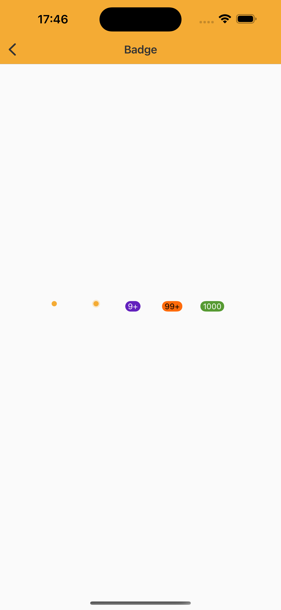

# Badge Component

> The Badge is a screen element used to signal the user's points of attention. This component can help you to display some simple information on the top of chosen drawable.
> Represents dynamic information such as number of notifications unread with some styles to match Nat DS appearance.

<br>

## Properties:

| Property           | Values                         | Status            |
| --------------     | -------------------------      | ----------------- |
| Variant             | Dot, Pulse, Standard                          | ✅  Available     |
| Color          | Primary, Secondary, Alert, Success   | ✅  Available     |
| Limit         | 9, 99, Unlimited        | ✅  Available     |

<br>
      
## Technical Usages Examples




```swift
    private lazy var badgeableViewDot: BadgeableView = {
        let view = BadgeableView(frame: .init(x: 0, y: 0, width: 24, height: 24))
        view.configure(badgeStyle: .dot, withColor: .primary)
        return view
    }()

    private lazy var badgeableViewPulse: BadgeableView = {
        let view = BadgeableView(frame: .init(x: 0, y: 0, width: 24, height: 24))
        view.configure(badgeStyle: .pulse, withColor: .primary)
        return view
    }()

    private lazy var badgeableViewOneChartStandard: BadgeableView = {
        let view = BadgeableView(frame: .init(x: 0, y: 0, width: 24, height: 24))
        view.configure(badgeStyle: .standard, withColor: .primary, theme: .avonLight)
        view.setBadge(count: 100)
        view.configure(limit: .max9)
        return view
    }()

    private lazy var badgeableViewTwoCharStandard: BadgeableView = {
        let view = BadgeableView(frame: .init(x: 0, y: 0, width: 24, height: 24))
        view.configure(badgeStyle: .standard, withColor: .secondary)
        view.setBadge(count: 100)
        view.configure(limit: .max99)
        return view
    }()

    private lazy var badgeableViewThreeCharStandard: BadgeableView = {
        let view = BadgeableView(frame: .init(x: 0, y: 0, width: 24, height: 24))
        view.configure(badgeStyle: .standard, withColor: .success)
        view.setBadge(count: 1000)
        view.configure(limit: .unlimited)
        return view
    }()
   ```
