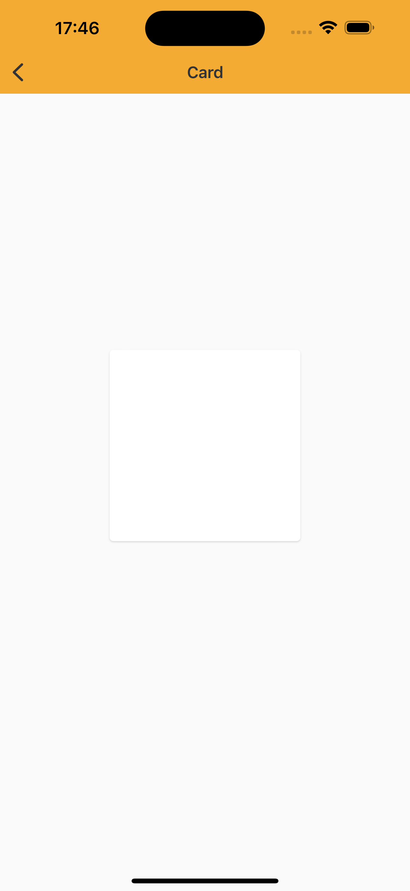

# Card

> Cards are surfaces that groups content and actions in the same space. Its construction must always create a visual hierarchy of the content and communicate its purposes.

## Properties:

| Property           | Values                         | Status            |
| --------------     | -------------------------      | ----------------- |
| Elavation             | True, False                           | ✅  Available     |
| Radius         | True, False    | ✅  Available     |

<br>

## Technical Usages Examples


<p align="center">
   
</p>

```swift
    var card = NatCard()
    card.configure(elevation: true)
    card.configure(borderRadius: true)
```
