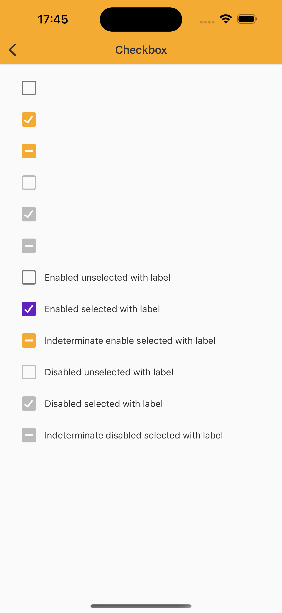

# Checkbox

> Checkboxes allow users to select one or more items from a set. Checkboxes can turn an option on or off.


## Properties

| Property           | Values                         | Status            |
| --------------     | -------------------------      | ----------------- |
| Variant             | Checked, Unchecked, Indeterminate                   | ✅  Available     |
| State          | Enabled, Pressed   | ✅  Available     |
| Disabled         | True or False        | ✅  Available     |


## Technical Usages Examples

<p align="center">
   
</p>

<br>

```swift
    private let enabledUnselectedCheckbox: NatCheckbox = {
        let checkbox = NatCheckbox()
        checkbox.translatesAutoresizingMaskIntoConstraints = false

        return checkbox
    }()

    private let enabledSelectedCheckbox: NatCheckbox = {
        let checkbox = NatCheckbox()
        checkbox.configure(isSelected: true)
        checkbox.translatesAutoresizingMaskIntoConstraints = false

        return checkbox
    }()

    private let indeterminateEnabledSelectedCheckbox: NatCheckbox = {
        let checkbox = NatCheckbox()
        checkbox.configure(isSelected: true)
        checkbox.configure(isIndeterminate: true)
        checkbox.translatesAutoresizingMaskIntoConstraints = false

        return checkbox
    }()

    private let disabledUnselectedCheckbox: NatCheckbox = {
        let checkbox = NatCheckbox()
        checkbox.configure(isSelected: false)
        checkbox.configure(isEnabled: false)
        checkbox.translatesAutoresizingMaskIntoConstraints = false

        return checkbox
    }()

    private let disabledSelectedCheckbox: NatCheckbox = {
        let checkbox = NatCheckbox()
        checkbox.configure(isSelected: true)
        checkbox.configure(isEnabled: false)
        checkbox.translatesAutoresizingMaskIntoConstraints = false

        return checkbox
    }()

    private let indeterminateDisabledSelectedCheckbox: NatCheckbox = {
        let checkbox = NatCheckbox()
        checkbox.configure(isSelected: true)
        checkbox.configure(isEnabled: false)
        checkbox.configure(isIndeterminate: true)
        checkbox.translatesAutoresizingMaskIntoConstraints = false

        return checkbox
    }()

    private let enabledUnselectedLabelCheckbox: NatCheckbox = {
        let checkbox = NatCheckbox(theme: .avonLight)
        checkbox.configure(text: "Enabled unselected with label")
        checkbox.translatesAutoresizingMaskIntoConstraints = false

        return checkbox
    }()

    private let enabledSelectedLabelCheckbox: NatCheckbox = {
        let checkbox = NatCheckbox(theme: .avonLight)
        checkbox.configure(isSelected: true)
        checkbox.configure(text: "Enabled selected with label")
        checkbox.translatesAutoresizingMaskIntoConstraints = false

        return checkbox
    }()

    private let disabledUnselectedLabelCheckbox: NatCheckbox = {
        let checkbox = NatCheckbox()
        checkbox.configure(isSelected: false)
        checkbox.configure(isEnabled: false)
        checkbox.configure(isIndeterminate: true)
        checkbox.configure(text: "Disabled unselected with label")
        checkbox.translatesAutoresizingMaskIntoConstraints = false

        return checkbox
    }()

    private let disabledSelectedLabelCheckbox: NatCheckbox = {
        let checkbox = NatCheckbox()
        checkbox.configure(isSelected: true)
        checkbox.configure(isEnabled: false)
        checkbox.configure(text: "Disabled selected with label")
        checkbox.translatesAutoresizingMaskIntoConstraints = false

        return checkbox
    }()

    private let indeterminateEnableSelectedLabelCheckbox: NatCheckbox = {
        let checkbox = NatCheckbox()
        checkbox.configure(isSelected: true)
        checkbox.configure(isEnabled: true)
        checkbox.configure(text: "Indeterminate enable selected with label")
        checkbox.configure(isIndeterminate: true)
        checkbox.translatesAutoresizingMaskIntoConstraints = false

        return checkbox
    }()

    // swiftlint:disable:next identifier_name
    private let indeterminateDisabledSelectedLabelCheckbox: NatCheckbox = {
        let checkbox = NatCheckbox()
        checkbox.configure(isSelected: true)
        checkbox.configure(isEnabled: false)
        checkbox.configure(text: "Indeterminate disabled selected with label")
        checkbox.configure(isIndeterminate: true)
        checkbox.translatesAutoresizingMaskIntoConstraints = false

        return checkbox
    }()
```
