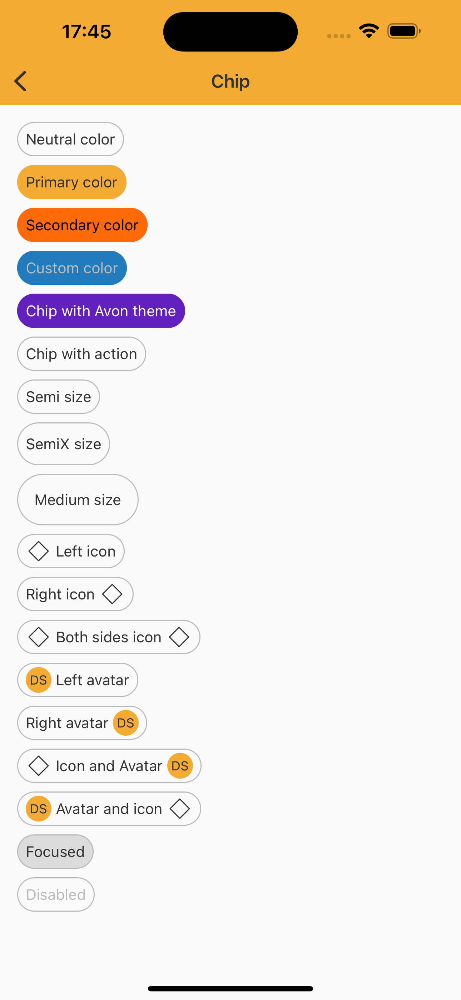

# Chip

> Chips are compact elements that represent an input, attribute, or action.

<br>

## Properties

| Property           | Values                         | Status            |
| --------------     | -------------------------      | ----------------- |
| Helper Before             | None, Icon, Avatar                          | ✅  Available     |
| Helper After          | None, Icon, Avatar    | ✅  Available     |
| Color         | Neutral, Primary, Secondary, Custom        | ✅  Available     |
| State          | Enabled, Press                    | ✅  Available     |
| Selected               | True, False           | ✅  Available     |
| Disabled               | True, False           | ✅  Available     |
| Action               | True, False           | ✅  Available     |
| Size               | Semi, SemiX, Medium           | ✅  Available     |

<br>

## Technical Usages Examples

<br>

<p align="center">
   
</p>

<br>


```swift
    private let neutralColorChip: NatChip = {
        let chip = NatChip()
        chip.configure(text: "Neutral color")
        return chip
    }()

    private let primaryColorChip: NatChip = {
        let chip = NatChip(color: .primary)
        chip.configure(text: "Primary color")
        return chip
    }()

    private let secondaryColorChip: NatChip = {
        let chip = NatChip(color: .secondary)
        chip.configure(text: "Secondary color")
        return chip
    }()

    private let customColorChip: NatChip = {
        let chip = NatChip(color: .custom(selectedColor: NatColors.link,
                                          labelColor: NatColors.lowEmphasis,
                                          borderColor: NatColors.alert))
        chip.configure(text: "Custom color")
        return chip
    }()
    
    private let customThemeChip: NatChip = {
        let chip = NatChip(color: .primary, theme: .avonLight)
        chip.configure(text: "Chip with Avon theme")
        return chip
    }()

    private let chipWithAction: NatChip = {
        let chip = NatChip()
        chip.configure(text: "Chip with action")
        return chip
    }()

    private let semiSizeChip: NatChip = {
        let chip = NatChip(size: .semi)
        chip.configure(text: "Semi size")
        return chip
    }()

    private let semiXSizeChip: NatChip = {
        let chip = NatChip(size: .semiX)
        chip.configure(text: "SemiX size")
        return chip
    }()

    private let mediumSizeChip: NatChip = {
        let chip = NatChip(size: .medium)
        chip.configure(text: "Medium size")
        return chip
    }()

    private let leftIconChip: NatChip = {
        let icon = getIcon(.outlinedDefaultMockup)
        let chip = NatChip()
        chip.configure(text: "Left icon")
        chip.configure(icon: icon, position: .left)
        return chip
    }()

    private let rightIconChip: NatChip = {
        let icon = getIcon(.outlinedDefaultMockup)
        let chip = NatChip()
        chip.configure(text: "Right icon")
        chip.configure(icon: icon, position: .right)
        return chip
    }()

    private let bothSidesIconChip: NatChip = {
        let icon = getIcon(.outlinedDefaultMockup)
        let chip = NatChip()
        chip.configure(text: "Both sides icon")
        chip.configure(icon: icon, position: .left)
        chip.configure(icon: icon, position: .right)
        return chip
    }()

    private let leftAvatarChip: NatChip = {
        let avatar = NatAvatar(size: .standard, type: .label)
        avatar.configure(name: "Design System")
        let chip = NatChip()
        chip.configure(text: "Left avatar")
        chip.configure(avatar: avatar, position: .left)
        return chip
    }()

    private let rightAvatarChip: NatChip = {
        let avatar = NatAvatar(size: .standard, type: .label)
        avatar.configure(name: "Design System")
        let chip = NatChip()
        chip.configure(text: "Right avatar")
        chip.configure(avatar: avatar, position: .right)
        return chip
    }()

    private let iconAndAvatarChip: NatChip = {
        let icon = getIcon(.outlinedDefaultMockup)
        let avatar = NatAvatar(size: .standard, type: .label)
        avatar.configure(name: "Design System")
        let chip = NatChip()
        chip.configure(text: "Icon and Avatar")
        chip.configure(icon: icon, position: .left)
        chip.configure(avatar: avatar, position: .right)
        return chip
    }()

    private let avatarAndIconChip: NatChip = {
        let icon = getIcon(.outlinedDefaultMockup)
        let avatar = NatAvatar(size: .standard, type: .label)
        avatar.configure(name: "Design System")
        let chip = NatChip()
        chip.configure(text: "Avatar and icon")
        chip.configure(avatar: avatar, position: .left)
        chip.configure(icon: icon, position: .right)
        return chip
    }()

    private let focusedChip: NatChip = {
        let chip = NatChip()
        chip.configure(text: "Focused")
        chip.configure(state: .focused)
        return chip
    }()

    private let disabledChip: NatChip = {
        let chip = NatChip()
        chip.configure(text: "Disabled")
        chip.configure(state: .disabled)
        return chip
    }()
```
