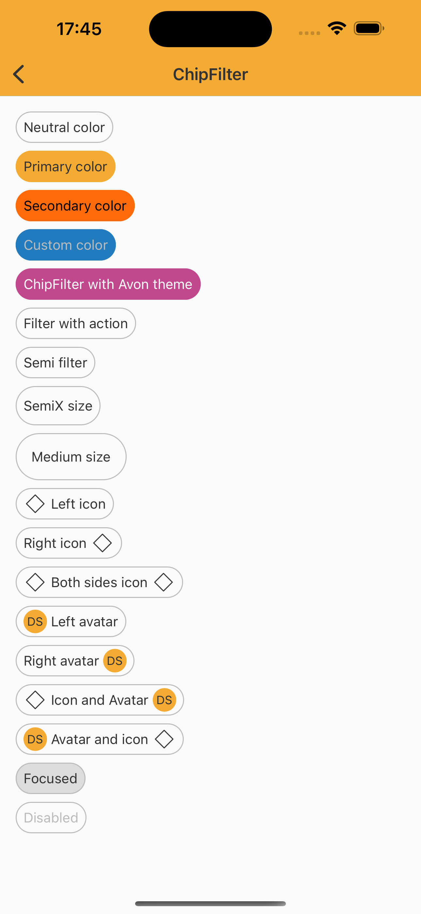

# ChipFilter

> Chips are compact elements that represent an input, attribute, or action.
> ChipFilter is an evolution of the Chip component to comply with the use of scrollview and not affect other users who use Chip today

<br>

## Properties

| Property           | Values                         | Status            |
| --------------     | -------------------------      | ----------------- |
| Helper Before             | None, Icon, Avatar                          | ✅  Available     |
| Helper After          | None, Icon, Avatar    | ✅  Available     |
| Color         | Neutral, Primary, Secondary, Custom        | ✅  Available     |
| State          | Enabled, Press                    | ✅  Available     |
| Selected               | True, False           | ✅  Available     |
| Disabled               | True, False           | ✅  Available     |
| Action               | True, False           | ✅  Available     |
| Size               | Semi, SemiX, Medium           | ✅  Available     |

<br>

## Technical Usages Examples

<br>

<p align="center">
   
</p>

<br>


```swift
    private let neutralColorChipFilter: NatChipFilter = {
        let filter = NatChipFilter()
        filter.configure(text: "Neutral color")
        return filter
    }()

    private let primaryColorChipFilter: NatChipFilter = {
        let filter = NatChipFilter(color: .primary)
        filter.configure(text: "Primary color")
        return filter
    }()

    private let secondaryColorChipFilter: NatChipFilter = {
        let filter = NatChipFilter(color: .secondary)
        filter.configure(text: "Secondary color")
        return filter
    }()

    private let customColorChipFilter: NatChipFilter = {
        let filter = NatChipFilter(color: .custom(selectedColor: NatColors.link,
                                          labelColor: NatColors.lowEmphasis,
                                          borderColor: NatColors.alert))
        filter.configure(text: "Custom color")
        return filter
    }()
    
    private let customThemeChip: NatChipFilter = {
        let chip = NatChipFilter(color: .secondary, theme: .avonLight)
        chip.configure(text: "ChipFilter with Avon theme")
        return chip
    }()

    private let chipFilterWithAction: NatChipFilter = {
        let filter = NatChipFilter()
        filter.configure(text: "Filter with action")
        return filter
    }()

    private let semiSizeChipFilter: NatChipFilter = {
        let filter = NatChipFilter(size: .semi)
        filter.configure(text: "Semi filter")
        return filter
    }()

    private let semiXSizeChipFilter: NatChipFilter = {
        let filter = NatChipFilter(size: .semiX)
        filter.configure(text: "SemiX size")
        return filter
    }()

    private let mediumSizeChipFilter: NatChipFilter = {
        let filter = NatChipFilter(size: .medium)
        filter.configure(text: "Medium size")
        return filter
    }()

    private let leftIconChipFilter: NatChipFilter = {
        let icon = getIcon(.outlinedDefaultMockup)
        let filter = NatChipFilter()
        filter.configure(text: "Left icon")
        filter.configure(icon: icon, position: .left)
        return filter
    }()

    private let rightIconChipFilter: NatChipFilter = {
        let icon = getIcon(.outlinedDefaultMockup)
        let filter = NatChipFilter()
        filter.configure(text: "Right icon")
        filter.configure(icon: icon, position: .right)
        return filter
    }()

    private let bothSidesIconChipFilter: NatChipFilter = {
        let icon = getIcon(.outlinedDefaultMockup)
        let filter = NatChipFilter()
        filter.configure(text: "Both sides icon")
        filter.configure(icon: icon, position: .left)
        filter.configure(icon: icon, position: .right)
        return filter
    }()

    private let leftAvatarChipFilter: NatChipFilter = {
        let avatar = NatAvatar(size: .standard, type: .label)
        avatar.configure(name: "Design System")
        let filter = NatChipFilter()
        filter.configure(text: "Left avatar")
        filter.configure(avatar: avatar, position: .left)
        return filter
    }()

    private let rightAvatarChipFilter: NatChipFilter = {
        let avatar = NatAvatar(size: .standard, type: .label)
        avatar.configure(name: "Design System")
        let filter = NatChipFilter()
        filter.configure(text: "Right avatar")
        filter.configure(avatar: avatar, position: .right)
        return filter
    }()

    private let iconAndAvatarChipFilter: NatChipFilter = {
        let icon = getIcon(.outlinedDefaultMockup)
        let avatar = NatAvatar(size: .standard, type: .label)
        avatar.configure(name: "Design System")
        let filter = NatChipFilter()
        filter.configure(text: "Icon and Avatar")
        filter.configure(icon: icon, position: .left)
        filter.configure(avatar: avatar, position: .right)
        return filter
    }()

    private let avatarAndIconChipFilter: NatChipFilter = {
        let icon = getIcon(.outlinedDefaultMockup)
        let avatar = NatAvatar(size: .standard, type: .label)
        avatar.configure(name: "Design System")
        let filter = NatChipFilter()
        filter.configure(text: "Avatar and icon")
        filter.configure(avatar: avatar, position: .left)
        filter.configure(icon: icon, position: .right)
        return filter
    }()

    private let focusedChipFilter: NatChipFilter = {
        let chipFilter = NatChipFilter()
        chipFilter.configure(text: "Focused")
        chipFilter.configure(state: .focused)
        return chipFilter
    }()

    private let disabledChipFilter: NatChipFilter = {
        let chipFilter = NatChipFilter()
        chipFilter.configure(text: "Disabled")
        chipFilter.configure(state: .disabled)
        return chipFilter
```
