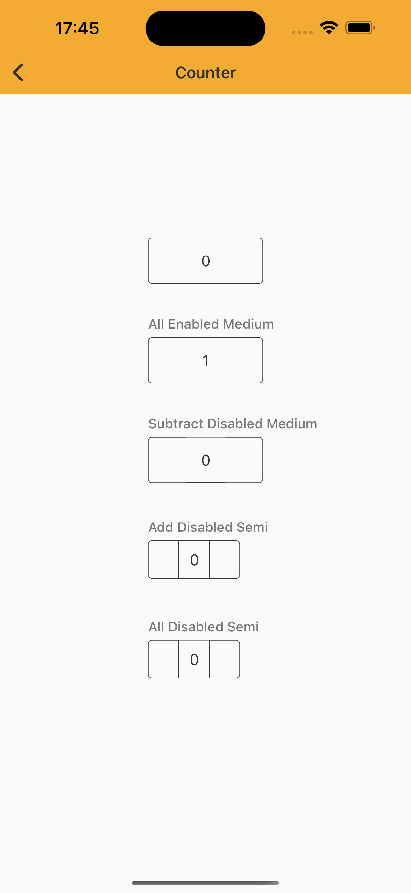

# Counter

> Reduce input effort for fields with values that deviate little from the default by allowing users to increase or decrease the number in a single button press.


## Properties

| Property           | Values                         | Status            |
| --------------     | -------------------------      | ----------------- |
| Label             | -                          | ✅  Available     |
| Size          | Semi X, Medium   | ✅  Available     |
| Disabled         | Subtract, Add, Both        | ✅  Available     |
| States          | Enabled, Press                    | ✅  Available     |


## Technical Usages Examples

<p align="center">
   
</p>


```swift
    let enableMediumCounter: NatCounter = {
        let counter = NatCounter(size: .medium)
        counter.translatesAutoresizingMaskIntoConstraints = false

        return counter
    }()

    let enableMediumCounterWithLabel: NatCounter = {
        let counter = NatCounter(size: .medium, minimumValue: .value1)
        counter.configure(label: "All Enabled Medium")
        counter.configureKeyboard(state: .disabled)
        counter.translatesAutoresizingMaskIntoConstraints = false
        
        return counter
    }()

    let subtractDisabledMediumCounter: NatCounter = {
        let counter = NatCounter(size: .medium)
        counter.configure(label: "Subtract Disabled Medium")
        counter.configure(button: .subtract, state: .disabled)
        counter.translatesAutoresizingMaskIntoConstraints = false

        return counter
    }()

    let addDisabledSemiCounter: NatCounter = {
        let counter = NatCounter(size: .semi)
        counter.configure(label: "Add Disabled Semi")
        counter.configure(button: .add, state: .disabled)
        counter.translatesAutoresizingMaskIntoConstraints = false

        return counter
    }()

    let allDisabledSemiCounter: NatCounter = {
        let counter = NatCounter(size: .semi)
        counter.configure(label: "All Disabled Semi")
        counter.configure(button: .all, state: .disabled)
        counter.translatesAutoresizingMaskIntoConstraints = false

        return counter
    }()
```
