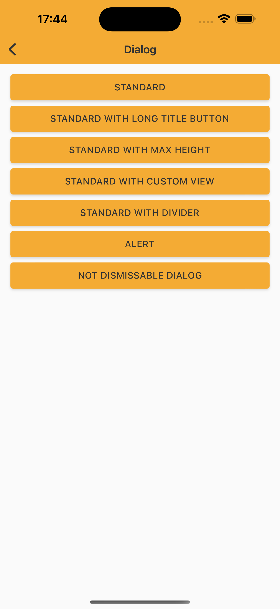
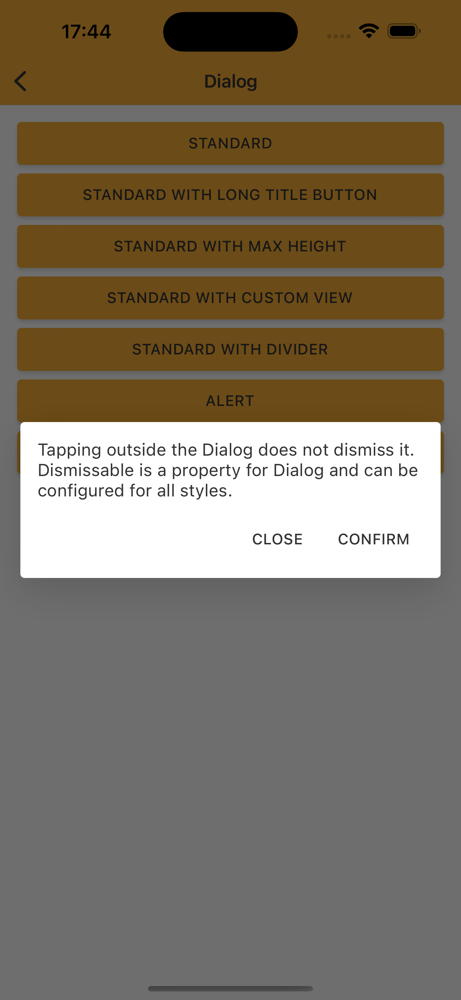
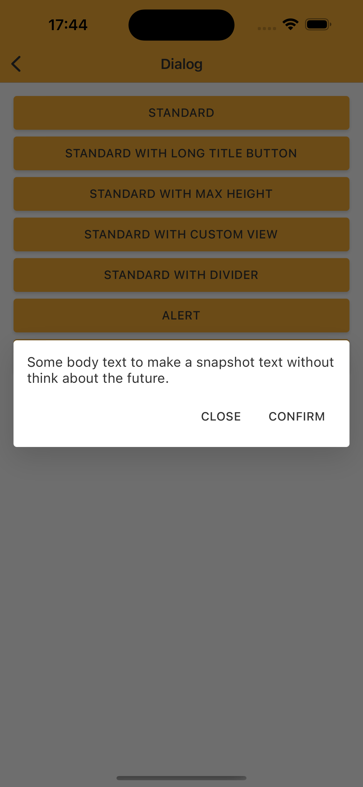
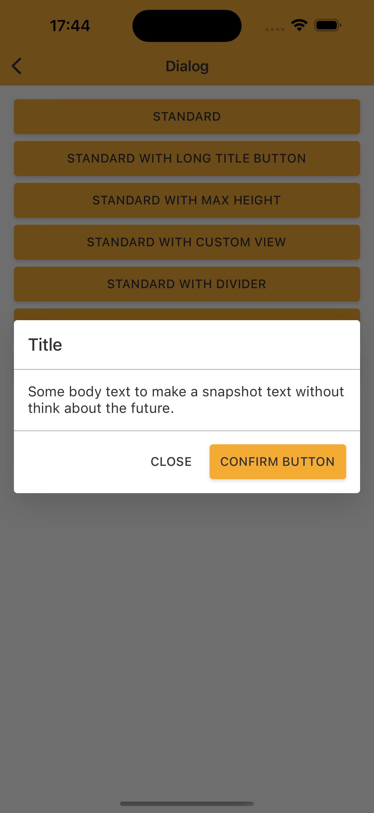
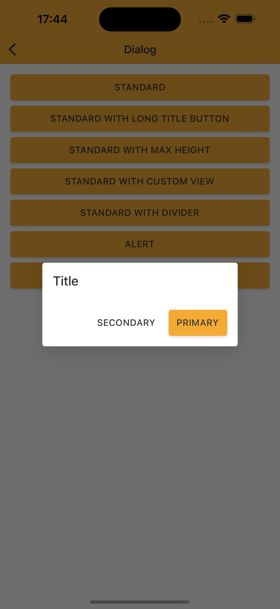
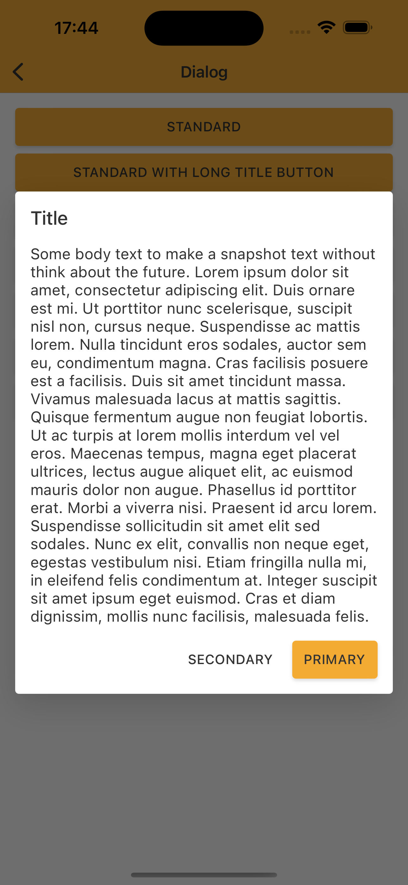
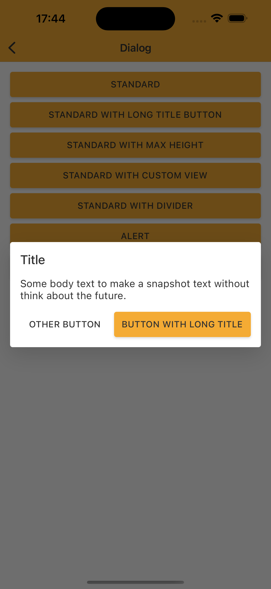
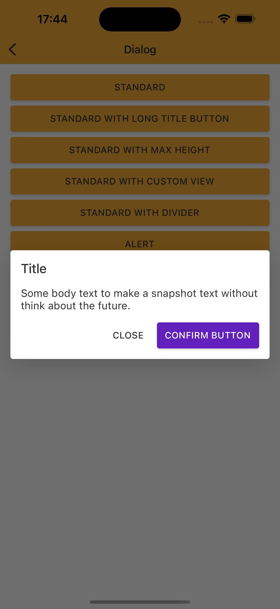

# Dialog

> Dialogs inform users about a task and can contain critical information, require decisions, or involve multiple tasks.

<br>

## Properties

| Property           | Values                         | Status            |
| --------------     | -------------------------      | ----------------- |
| Variant             | Standard, Alert                          | ✅  Available     |
| Divider          | None, Show   | ✅  Available     |
| Scroll         | None, Show, Auto        | ✅  Available     |
| Width          | -                    | ✅  Available     |
| Height               | -            | ✅  Available     |

<br>


## Technical Usages Examples


<p align="center">
   
&nbsp; &nbsp; &nbsp; 
  
&nbsp; &nbsp; &nbsp; 
  
 &nbsp; &nbsp;&nbsp; 
  
</p>
<br>

<p align="center">
  
  
&nbsp; &nbsp; &nbsp; 
  
 &nbsp; &nbsp;&nbsp; 
  
&nbsp; &nbsp; &nbsp; 
  
</p>
<br>


```swift
    @objc func showStandardDialog() {
        let dialog = NatDialogController
            .standardStyleBuilder
            .configure(title: "Title")
            .configure(body: "Some body text to make a snapshot text without think about the future.")
            .configure(primaryButtonTitle: "Confirm button", theme: .avonLight) {
                self.navigationController?.presentedViewController?.dismiss(animated: true)
            }
            .configure(secondaryButtonTitle: "Close") {
                self.navigationController?.presentedViewController?.dismiss(animated: true)
            }
            .configure(dismissActionHandler: {
                print("Standard Dialog was dismissed")
            })
            .build()

        navigationController?.present(dialog, animated: true)
    }

    @objc func showStandardLongTextDialog() {
        let dialog = NatDialogController
            .standardStyleBuilder
            .configure(title: "Title")
            .configure(body: "Some body text to make a snapshot text without think about the future.")
            .configure(primaryButtonTitle: "Button with long title") {
                self.navigationController?.presentedViewController?.dismiss(animated: true)
            }
            .configure(secondaryButtonTitle: "Other button") {
                self.navigationController?.presentedViewController?.dismiss(animated: true)
            }
            .build()

        navigationController?.present(dialog, animated: true)
    }

    // swiftlint:disable line_length
    @objc func showStandardBigViewDialog() {
        let dialog = NatDialogController
            .standardStyleBuilder
            .configure(title: "Title")
            .configure(body: "Some body text to make a snapshot text without think about the future. Lorem ipsum dolor sit amet, consectetur adipiscing elit. Duis ornare est mi. Ut porttitor nunc scelerisque, suscipit nisl non, cursus neque. Suspendisse ac mattis lorem. Nulla tincidunt eros sodales, auctor sem eu, condimentum magna. Cras facilisis posuere est a facilisis. Duis sit amet tincidunt massa. Vivamus malesuada lacus at mattis sagittis. Quisque fermentum augue non feugiat lobortis. Ut ac turpis at lorem mollis interdum vel vel eros. Maecenas tempus, magna eget placerat ultrices, lectus augue aliquet elit, ac euismod mauris dolor non augue. Phasellus id porttitor erat. Morbi a viverra nisi. Praesent id arcu lorem. Suspendisse sollicitudin sit amet elit sed sodales. Nunc ex elit, convallis non neque eget, egestas vestibulum nisi. Etiam fringilla nulla mi, in eleifend felis condimentum at. Integer suscipit sit amet ipsum eget euismod. Cras et diam dignissim, mollis nunc facilisis, malesuada felis.")
            .configure(primaryButtonTitle: "Primary") {
                self.navigationController?.presentedViewController?.dismiss(animated: true)
            }
            .configure(secondaryButtonTitle: "Secondary") {
                self.navigationController?.presentedViewController?.dismiss(animated: true)
            }
            .build()

        navigationController?.present(dialog, animated: true)
    }

    @objc func showStandardCustomViewDialog() {
        let dialog = NatDialogController
            .standardStyleBuilder
            .configure(title: "Title")
            .configure(body: NatImage())
            .configure(primaryButtonTitle: "Primary") {
                self.navigationController?.presentedViewController?.dismiss(animated: true)
            }
            .configure(secondaryButtonTitle: "Secondary") {
                self.navigationController?.presentedViewController?.dismiss(animated: true)
            }
            .build()

        navigationController?.present(dialog, animated: true)
    }
    @objc func showDividerStandardDialog() {
        let dialog = NatDialogController
            .standardStyleBuilder
            .configure(title: "Title")
            .configure(divider: true)
            .configure(body: "Some body text to make a snapshot text without think about the future.")
            .configure(primaryButtonTitle: "Confirm button") {
                self.navigationController?.presentedViewController?.dismiss(animated: true)
            }
            .configure(secondaryButtonTitle: "Close") {
                self.navigationController?.presentedViewController?.dismiss(animated: true)
            }
            .build()

        navigationController?.present(dialog, animated: true)
    }

    @objc func showAlertDialog() {
        let dialog = NatDialogController
            .alertStyleBuilder
            .configure(body: "Some body text to make a snapshot text without think about the future.")
            .configure(primaryButtonTitle: "Confirm") {
                self.navigationController?.presentedViewController?.dismiss(animated: true)
            }
            .configure(secondaryButtonTitle: "Close") {
                self.navigationController?.presentedViewController?.dismiss(animated: true)
            }
            .build()

        navigationController?.present(dialog, animated: true)
    }

    @objc func showNotDismissableDialog() {
        let dialog = NatDialogController
            .alertStyleBuilder
            .configure(body: "Tapping outside the Dialog does not dismiss it. Dismissable is a property for Dialog and can be configured for all styles.")
            .configure(isDismissable: false)
            .configure(primaryButtonTitle: "Confirm") {
                self.navigationController?.presentedViewController?.dismiss(animated: true)
            }
            .configure(secondaryButtonTitle: "Close") {
                self.navigationController?.presentedViewController?.dismiss(animated: true)
            }
            .build()

        navigationController?.present(dialog, animated: true)
    }
```
