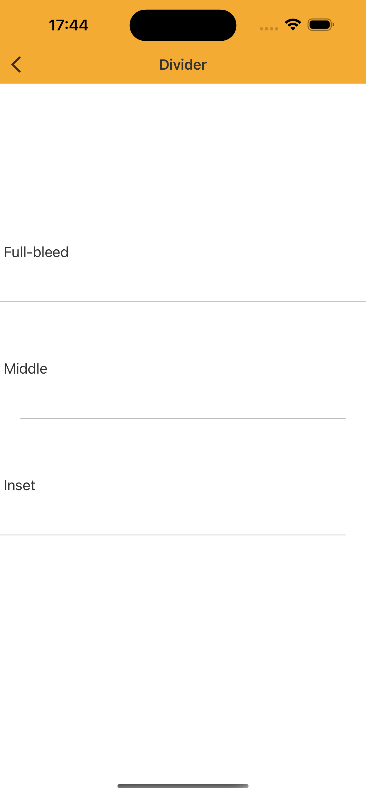

# Divider
> A divider is a thin line that groups content in lists and layouts.


## Properties

| Property           | Values                         | Status            |
| --------------     | -------------------------      | ----------------- |
| Variants         | Full-bleed, Inset, Middle        | ✅  Available     |


## Technical Usages Examples



<br>


```swift
    private let dividerFullBleed: Divider = {
        let divider = Divider()
        divider.configure(style: .fullBleed)
        divider.translatesAutoresizingMaskIntoConstraints = false

        return divider
    }()

    private let dividerMiddle: Divider = {
        let divider = Divider()
        divider.configure(style: .middle)
        divider.translatesAutoresizingMaskIntoConstraints = false

        return divider
    }()

    private let dividerInset: Divider = {
        let divider = Divider()
        divider.configure(style: .inset)
        divider.translatesAutoresizingMaskIntoConstraints = false

        return divider
    }()
```

## Attention points
   
1. Margin spacing is fixed and not customizable.
