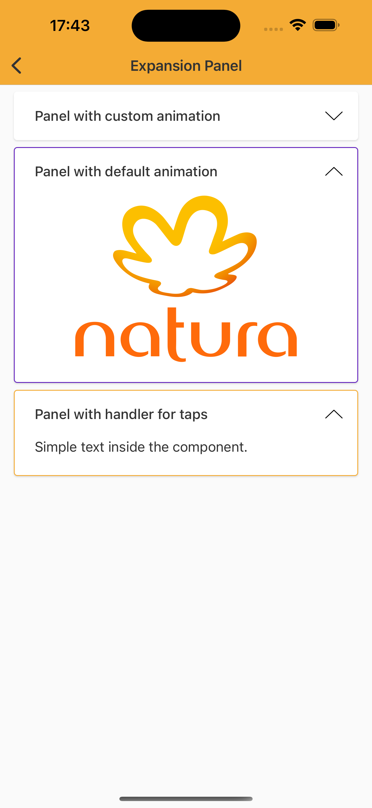

# Expansion Panel

> Expansion Panel is a component to display a title when collapsed and can have any other component inside it. This other component can be displayed when Expansion Panel is opened.

## Technical Usages Examples

[]

```swift
    private lazy var panel: ExpansionPanel = {
        let expansionPanel = ExpansionPanel()
        expansionPanel.setSubtitle("Panel with custom animation")
        expansionPanel.translatesAutoresizingMaskIntoConstraints = false
        return expansionPanel
    }()

    private lazy var secondPanel: ExpansionPanel = {
        let expansionPanel = ExpansionPanel(theme: .avonLight)
        expansionPanel.setSubtitle("Panel with default animation")
        expansionPanel.translatesAutoresizingMaskIntoConstraints = false
        return expansionPanel
    }()

    private lazy var thirdPanel: ExpansionPanel = {
        let expansionPanel = ExpansionPanel()
        expansionPanel.setSubtitle("Panel with handler for taps")
        expansionPanel.translatesAutoresizingMaskIntoConstraints = false
        return expansionPanel
    }()
```
