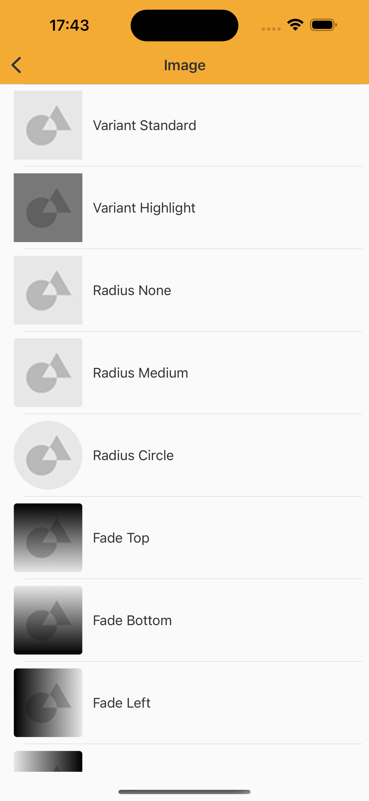
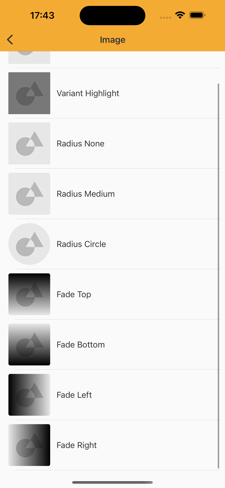

# Image
> Informs the user of image content with possible resources for greater interaction

<br>

## Properties

| Property           | Values                         | Status            |
| --------------     | -------------------------      | ----------------- |
| Variant             | Standard, Highlight      | ✅  Available     |
| Radius          | None, Medium, Circle  | ✅  Available     |
| Fade         | Top, Bottom, Left, Right        | ✅  Available     |
| Fallback          | URL                    | ✅  Available     |

<br>

## Technical Usages Examples

<p align="center">
   
&nbsp;
  
</p>

<br>

```swift
    private var natImageView: NatImage = {
        let view = NatImage()
        view.translatesAutoresizingMaskIntoConstraints = false
        return view
    }()
    
    natImageView.configure(variant: viewModel.variant)
    natImageView.configureRadius(viewModel.radius)
    natImageView.configure(setImage: UIImage(named: "ImageAreaPlaceholder"))
    natImageView.configure(contentMode: .scaleAspectFill)
    natImageView.configureFade(.top)
```
