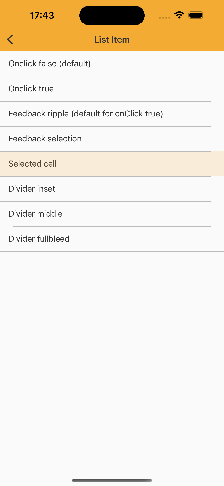

# List Item

> Lists are continuous, vertical indexes of content such as text and images.

## Properties

| Property           | Values                         | Status            |
| --------------     | -------------------------      | ----------------- |
| Type             | None, Action, Selectable                           | ✅  Available     |
| States          | Enabled, Press, Selectable   | ✅  Available     |


## Technical Usages Examples




```swift
class SampleCustomCell: NatListItemCell {
    var title: String? {
        didSet {
            label.text = title
        }
    }

    var containerView: UIView = {
        let view = UIView()
        view.translatesAutoresizingMaskIntoConstraints = false
        return view
    }()

    var label: UILabel = {
        let label = UILabel()
        label.translatesAutoresizingMaskIntoConstraints = false
        label.font = NatFonts.font(ofSize: .body1)
        label.textColor = NatColors.highEmphasis
        return label
    }()

    override init(style: UITableViewCell.CellStyle, reuseIdentifier: String?) {
        super.init(style: style, reuseIdentifier: reuseIdentifier)

        contentView.addSubview(containerView)
        containerView.leadingAnchor.constraint(equalTo: leadingAnchor).isActive = true
        containerView.trailingAnchor.constraint(equalTo: trailingAnchor).isActive = true
        containerView.topAnchor.constraint(equalTo: topAnchor).isActive = true
        containerView.bottomAnchor.constraint(equalTo: bottomAnchor).isActive = true

        contentView.addSubview(label)
        label.centerYAnchor.constraint(equalTo: centerYAnchor).isActive = true
        label.leadingAnchor.constraint(equalTo: leadingAnchor, constant: 16).isActive = true

        // super class method configure views
        commonInit()
    }

    required init?(coder aDecoder: NSCoder) {
        fatalError("init(coder:) has not been implemented")
    }
}

extension ListItemViewController: UITableViewDelegate, UITableViewDataSource {
    func tableView(_ tableView: UITableView, numberOfRowsInSection section: Int) -> Int {
        return 8
    }

    func tableView(_ tableView: UITableView, cellForRowAt indexPath: IndexPath) -> UITableViewCell {

        let cell: SampleCustomCell = (tableView.dequeueReusableCell(withIdentifier: "id",
                                                                    for: indexPath) as? SampleCustomCell)!

        switch indexPath.row {
        case 0:
            cell.title = "Onclick false (default)"
            cell.configure(divider: .inset)
        case 1:
            cell.configure(onClick: true)
            cell.title = "Onclick true"
            cell.configure(divider: .inset)
        case 2:
            cell.configure(onClick: true)
            cell.title = "Feedback ripple (default for onClick true)"
            cell.configure(divider: .inset)
        case 3:
            cell.configure(onClick: true)
            cell.configure(feedbackStyle: .selection)
            cell.title = "Feedback selection"
            cell.configure(divider: .inset)
        case 4:
            cell.configure(onClick: true)
            cell.title = "Selected cell"
            cell.configure(divider: .inset)
        case 5:
            cell.configure(divider: .inset)
            cell.title = "Divider inset"
        case 6:
            cell.configure(divider: .middle)
            cell.title = "Divider middle"
        case 7:
            cell.configure(divider: .fullBleed)
            cell.title = "Divider fullbleed"
        default:
            cell.configure(divider: .inset)
        }
        return cell
    }

    func tableView(_ tableView: UITableView, willDisplay cell: UITableViewCell, forRowAt indexPath: IndexPath) {
        if indexPath.row == 4 {
            cell.setSelected(true, animated: true)
            tableView.selectRow(at: indexPath, animated: false, scrollPosition: .none)
        }
    }

    func tableView(_ tableView: UITableView, heightForRowAt indexPath: IndexPath) -> CGFloat {
        return NatSizes.medium
    }
}
```
