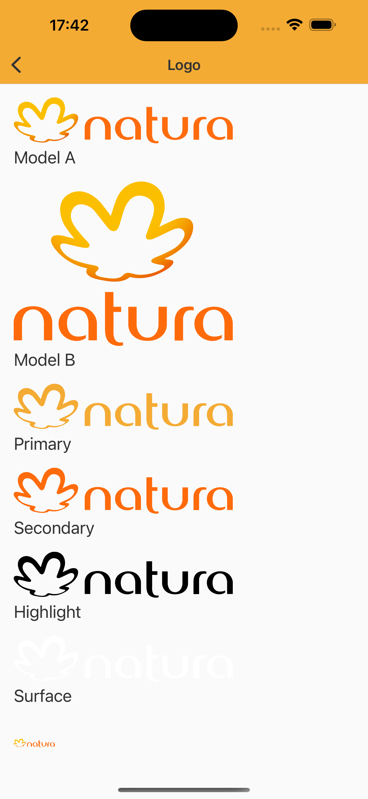
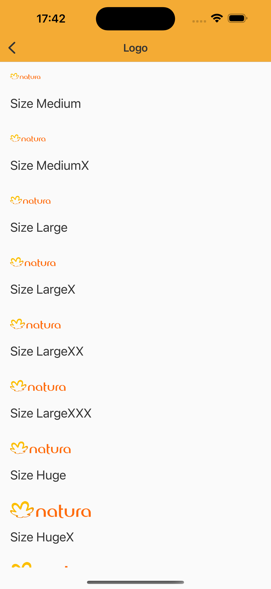
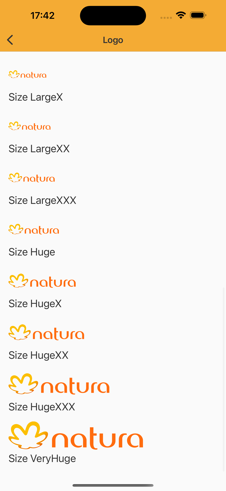

# Logo
Logo adapted as brand standards for each company.

<br>

## Properties

| Property           | Values                         | Status            |
| --------------     | -------------------------      | ----------------- |
| Variant             | Natura, Avon, The Body Shop, Natura&Co, Natura v2, Avon v2, Consultoria de Beleza       | ✅  Available     |
| Model          | A, B   | ✅  Available     |
| Color         | Primary, Secondary, Highlight, Surface, Neutral        | ✅  Available     |
| Size          | Medium, MediumX, Large, LargeX, LargeXX, LargeXXX, Huge, HugeX, HugeXX, HugeXXX, VeryHuge                    | ✅  Available     |
| Language               | Pt, Es, Default            | ✅  Available     |

<br>

## Technical Usages Examples

<p align="center">
   
&nbsp;
  
   &nbsp;
  
</p>

<br>

```swift
let logo = NatLogo(size: size)
logo.configure(model: model, lang: lang)
logo.configure(color: color)
```
