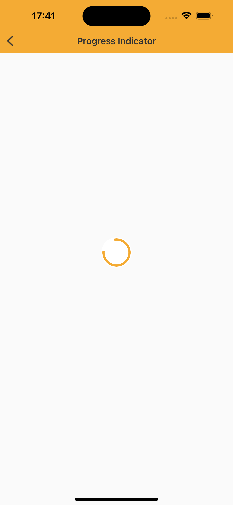

# Progress Indicator

> Progress indicators express an unspecified wait time or display the length of a process.


## Properties

| Property           | Values                         | Status            |
| --------------     | -------------------------      | ----------------- |
| Type             | Indeterminated                          | ✅  Available     |
| Size          | Standard, Semi, Medium, Large   | ✅  Available     |
| Layer         | True or False        | ✅  Available     |


## Technical Usages Examples



```swift
let progressIndicator = NatProgressIndicatorCircular(size: .medium)
progressIndicator.configure(useBackgroundLayer: true)
```
<br>

## Attention points
   
1. Nat DS iOS supports for now only Circular variant of Progress Indicator
