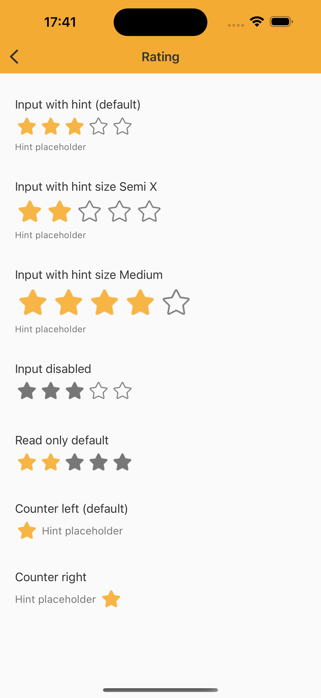

# Rating

> Provides a user interactive stars for rating or checking something’s rating.

## Properties

| Property           | Values                         | Status            |
| --------------     | -------------------------      | ----------------- |
| Variant             | Input, Read-Only, Counter                          | ✅  Available     |
| State          | Enabled, Press   | ✅  Available     |
| Hint          | True, False   | ✅  Available     |
| Size          | Small, Standard, Semi, Semix   | ✅  Available     |
| Align          | Left, Right   | ✅  Available     |
| Disabled          | True, False   | ✅  Available     |
| Rate          | 0, 1, 2, 3, 4, 5  | ✅  Available     |


## Technical Usages Examples




```swift
    let inputRatingWithHint: NatRating = {
        let rating = NatRating(style: .input)
        rating.configure(text: "Hint placeholder")
        return rating
    }()

    let inputRatingWithHintSemiX: NatRating = {
        let rating = NatRating(style: .input, size: .semiX)
        rating.configure(text: "Hint placeholder")
        return rating
    }()

    let inputRatingWithHintMedium: NatRating = {
        let rating = NatRating(style: .input, size: .medium)
        rating.configure(text: "Hint placeholder")
        return rating
    }()

    let inputRatingDisabled: NatRating = {
        let rating = NatRating(style: .input)
        rating.configure(rate: 3)
        rating.configure(state: .disabled)
        return rating
    }()

    let readOnlyRating: NatRating = {
        let rating = NatRating(style: .readOnly)
        rating.configure(rate: 2)
        return rating
    }()

    let counterRating: NatRating = {
        let rating = NatRating(style: .counter)
        rating.configure(text: "Hint placeholder")
        return rating
    }()

    let counterRatingRight: NatRating = {
        let rating = NatRating(style: .counter, alignment: .right)
        rating.configure(text: "Hint placeholder")
        return rating
    }()
```
