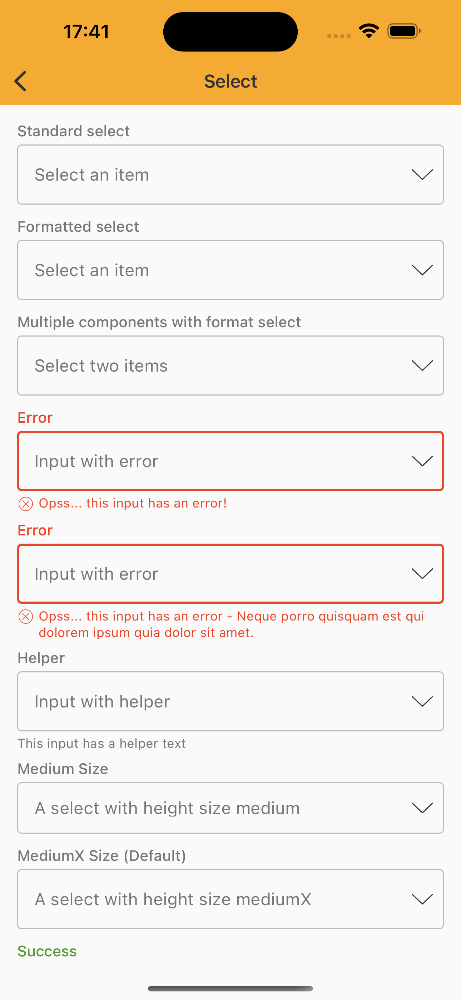
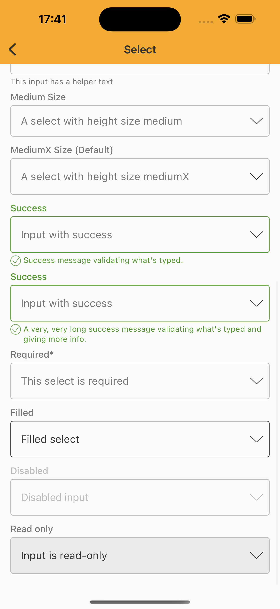

# Select

> Select lets user choose one option from an options menu. Consider using select when you have 4 or
more options.


## Properties

| Property           | Values                         | Status            |
| --------------     | -------------------------      | ----------------- |
| Variant             | Standard                          | ✅  Available     |
| Label             | -                          | ✅  Available     |
| Footer             | -                          | ✅  Available     |
| Size             | Medium, MediumX                          | ✅  Available     |
| States             | None, Success, Error                          | ✅  Available     |
| Required             | True, False                          | ✅  Available     |
| Read-only             | True, False                          | ✅  Available     |
| Disabled             | -                          | ✅  Available     |


## Technical Usages Examples

<br>

<p align="center">
   
&nbsp;
  
</p>

<br>


```swift
    private lazy var standardSelect: NatSelect = {
        let field = TextField(theme: .avonLight)
        field.title = "Standard select"
        field.type = .text
        field.placeholder = "Select an item"
        let select = NatSelect(textField: field)
        select.configure(data: ["Item 1", "Item 2"])
        return select
    }()

    private lazy var formattedSelect: NatSelect = {
        let field = TextField()
        field.title = "Formatted select"
        field.type = .text
        field.placeholder = "Select an item"
        let select = NatSelect(textField: field)
        select.configure(data: ["Item 1", "Item 2"])
        select.configure(format: "Selected: %@")
        return select
    }()

    private lazy var multipleComponentsWithFormatSelect: NatSelect = {
        let field = TextField()
        field.title = "Multiple components with format select"
        field.type = .text
        field.placeholder = "Select two items"
        let select = NatSelect(textField: field)
        select.configure(data: [0: ["Item 1", "Item 2"],
                                1: ["Item 3", "Item 4"]])
        select.configure(format: "First: %@, second: %@")
        return select
    }()

    private lazy var errorSelect: NatSelect = {
        let field = TextField()
        field.title = "Error"
        field.placeholder = "Input with error"
        field.configure(state: .error, with: "Opss... this input has an error!")
        let select = NatSelect(textField: field)
        select.configure(data: ["Item 1", "Item 2"])
        return select
    }()

    private lazy var errorSelectMultipleLines: NatSelect = {
        let field = TextField()
        field.title = "Error"
        field.placeholder = "Input with error"
        field.configure(state: .error,
                        with: "Opss... this input has an error - Neque porro quisquam est qui dolorem ipsum quia dolor sit amet.")
        let select = NatSelect(textField: field)
        select.configure(data: ["Item 1", "Item 2"])
        return select
    }()

    private lazy var helperSelect: NatSelect = {
        let field = TextField()
        field.title = "Helper"
        field.placeholder = "Input with helper"
        field.helper = "This input has a helper text"
        let select = NatSelect(textField: field)
        select.configure(data: ["Item 1", "Item 2"])
        return select
    }()

    private lazy var mediumSelect: NatSelect = {
        let field = TextField()
        field.configure(size: .medium)
        field.title = "Medium Size"
        field.type = .text
        field.placeholder = "A select with height size medium"
        let select = NatSelect(textField: field)
        select.configure(data: ["Item 1", "Item 2"])
        return select
    }()

    private lazy var mediumXSelect: NatSelect = {
        let field = TextField()
        field.configure(size: .mediumX)
        field.title = "MediumX Size (Default)"
        field.type = .text
        field.placeholder = "A select with height size mediumX"
        let select = NatSelect(textField: field)
        select.configure(data: ["Item 1", "Item 2"])
        return select
    }()

    private lazy var successSelect: NatSelect = {
        let field = TextField()
        field.title = "Success"
        field.type = .text
        field.placeholder = "Input with success"
        field.configure(state: .success, with: "Success message validating what's typed.")
        let select = NatSelect(textField: field)
        select.configure(data: ["Item 1", "Item 2"])
        return select
    }()

    private lazy var longSuccessSelect: NatSelect = {
        let field = TextField()
        field.title = "Success"
        field.type = .text
        field.placeholder = "Input with success"
        field.configure(state: .success,
                        with: "A very, very long success message validating what's typed and giving more info.")
        let select = NatSelect(textField: field)
        select.configure(data: ["Item 1", "Item 2"])
        return select
    }()

    private lazy var requiredSelect: NatSelect = {
        let field = TextField()
        field.title = "Required"
        field.type = .text
        field.placeholder = "This select is required"
        field.configure(required: true)
        let select = NatSelect(textField: field)
        select.configure(data: ["Item 1", "Item 2"])
        return select
    }()

    private lazy var disabledSelect: NatSelect = {
        let field = TextField()
        field.title = "Disabled"
        field.type = .text
        field.placeholder = "Disabled input"
        field.configure(isEnabled: false)
        let select = NatSelect(textField: field)
        select.configure(data: ["Item 1", "Item 2"])
        return select
    }()

    private lazy var readOnlySelect: NatSelect = {
        let field = TextField()
        field.title = "Read only"
        field.type = .text
        field.text = "Input is read-only"
        field.configure(readOnly: true)
        let select = NatSelect(textField: field)
        select.configure(data: ["Item 1", "Item 2"])
        return select
    }()

    private lazy var filledSelect: NatSelect = {
        let field = TextField()
        field.title = "Filled"
        field.type = .text
        field.text = "Filled select"
        let select = NatSelect(textField: field)
        select.configure(data: ["Item 1", "Item 2"])
        return select
    }()
```
