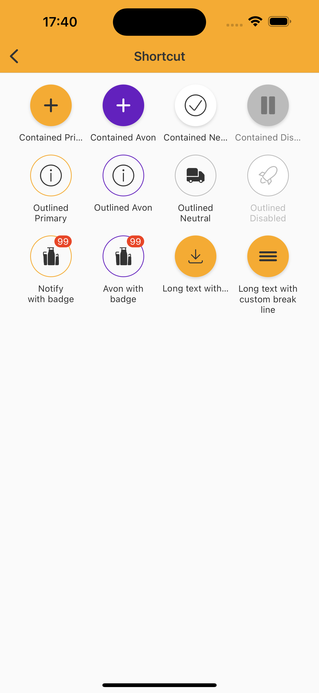

# Shortcut

> Shortcuts for quick access to a page and facilitate navigation.  

## Properties

| Property           | Values                         | Status            |
| --------------     | -------------------------      | ----------------- |
| Variant             | Standard, Outlined                          | ✅  Available     |
| Size          | Medium, MediumX   | ✅  Available     |
| State         | Enabled, Press         | ✅  Available     |
| Color          | Contained Primary, Contained Light, Outlined Primary, Outlined Light       | ✅  Available     |
| Notify               | None, Standard            | ✅  Available     |


## Technical Usages Examples



```swift
        // Contained
        let containedPrimaryShortcut = NatShortcut(style: .contained, color: .primary,
                                                   text: "Contained Primary", icon: getIcon(.filledActionAdd))
        let containedThemePrimaryShortcut = NatShortcut(style: .contained, color: .primary,
                                                   text: "Contained Avon", icon: getIcon(.filledActionAdd), theme: .avonLight)
        let containedNeutralShortcut = NatShortcut(style: .contained, color: .neutral,
                                                   text: "Contained Neutral", icon: getIcon(.outlinedAlertCheck))
        let containedDisabledShortcut = NatShortcut(style: .contained,
                                                    text: "Contained Disabled", icon: getIcon(.filledMediaPause))
        containedDisabledShortcut.configure(state: .disabled)
        containedPrimaryShortcut.configureText(numberOfLines: 1, lineBreakMode: .byTruncatingTail)
        containedThemePrimaryShortcut.configureText(numberOfLines: 1, lineBreakMode: .byTruncatingTail)
        containedNeutralShortcut.configureText(numberOfLines: 1, lineBreakMode: .byTruncatingTail)
        containedDisabledShortcut.configureText(numberOfLines: 1, lineBreakMode: .byTruncatingTail)

        // Outlined
        let outlinedPrimaryShortcut = NatShortcut(style: .outlined, color: .primary,
                                                  text: "Outlined Primary", icon: getIcon(.outlinedAlertInfo))
        
        let outlinedThemePrimaryShortcut = NatShortcut(style: .outlined, color: .primary,
                                                       text: "Outlined Avon", icon: getIcon(.outlinedAlertInfo), theme: .avonLight)
        
        let outlinedNeutralShortcut = NatShortcut(style: .outlined, color: .neutral,
                                                  text: "Outlined Neutral", icon: getIcon(.filledPlaceTruck))
        let outlinedDisabledShortcut = NatShortcut(style: .outlined,
                                                   text: "Outlined Disabled", icon: getIcon(.outlinedPlaceRocket))
        outlinedDisabledShortcut.configure(state: .disabled)

        // Other configurations
        let containedBadgeShortcut = NatShortcut(style: .outlined, color: .primary,
                                                 text: "Notify with badge", icon: getIcon(.filledProductBrandsproduct))
        let containedThemeBadgeShortcut = NatShortcut(style: .outlined, color: .primary,
                                                      text: "Avon with badge", icon: getIcon(.filledProductBrandsproduct), theme: .avonLight)
        let longTextNoBreakLineShorcut = NatShortcut(style: .contained, color: .primary,
                                                     text: "Long text with one line only",
                                                     icon: getIcon(.outlinedActionDownload))
        let longTextBreakLineShortcut = NatShortcut(style: .contained, color: .primary,
                                                    text: "Long text with custom break line",
                                                    icon: getIcon(.filledNavigationMenu))
        longTextBreakLineShortcut.configureText(numberOfLines: 3, lineBreakMode: .byWordWrapping)
        longTextNoBreakLineShorcut.configureText(numberOfLines: 1, lineBreakMode: .byTruncatingTail)

        let badge = NatBadge(style: .standard, color: .alert)
        badge.configure(count: 99)
        containedBadgeShortcut.configure(badge: badge)
        
        let badgeAvon = NatBadge(style: .standard, color: .alert, theme: .avonLight)
        badgeAvon.configure(count: 99)
        containedThemeBadgeShortcut.configure(badge: badgeAvon)
```
