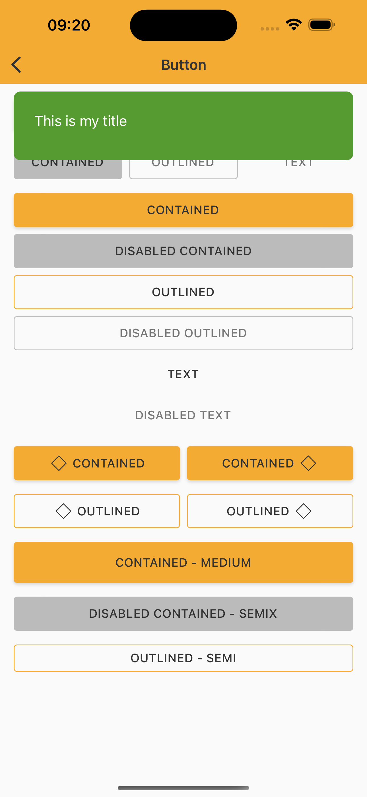
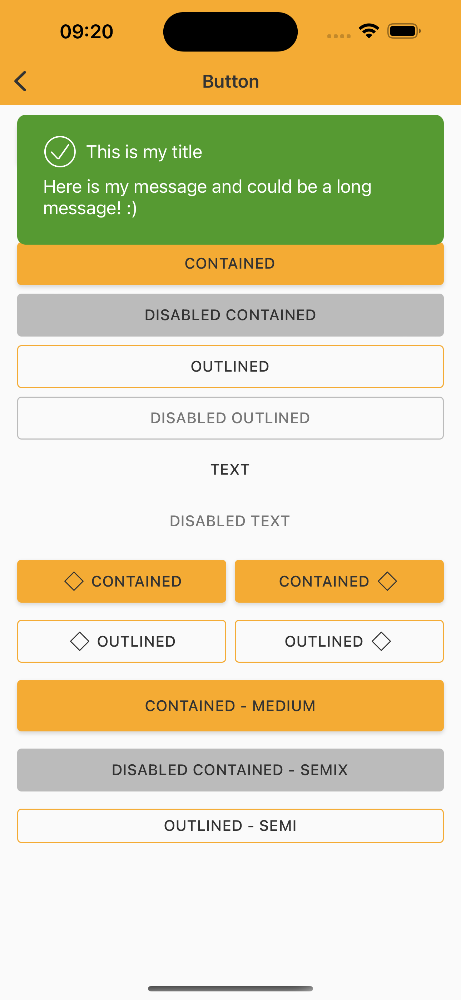
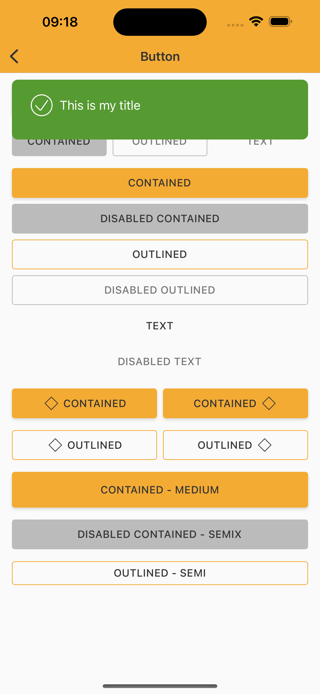
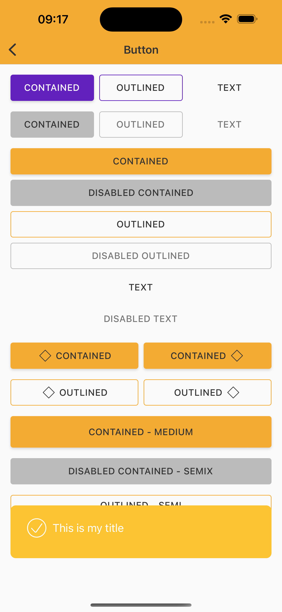
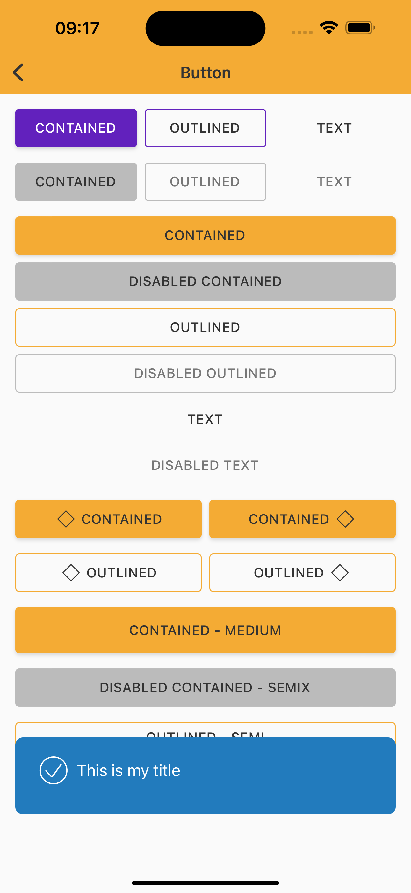
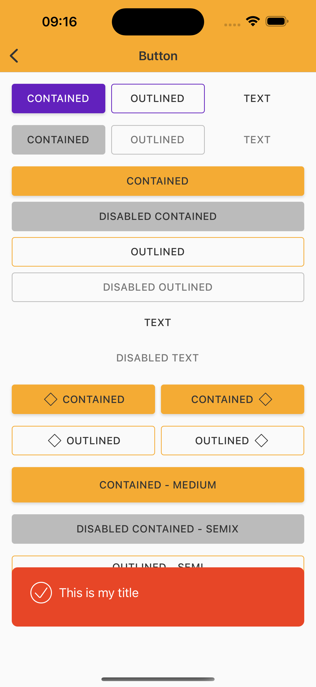
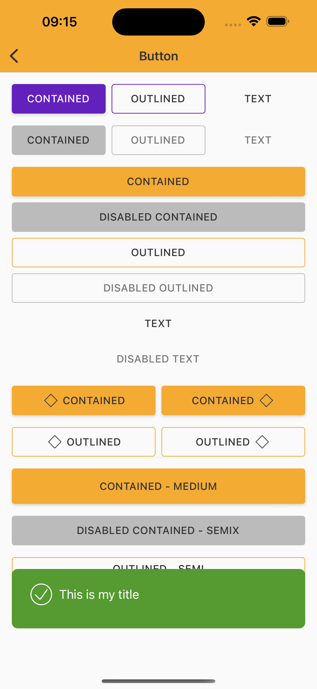
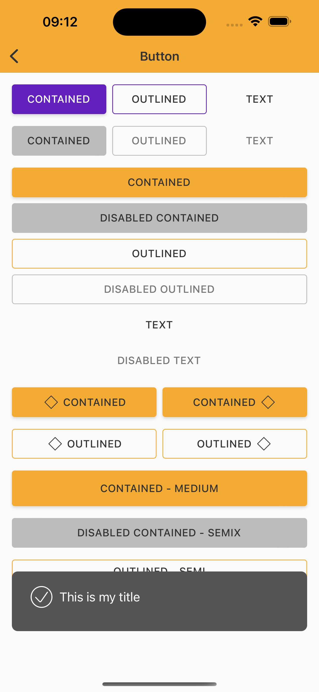

# Snackbar

> Snackbars provide brief messages about app processes at the bottom of the screen.

<br>

## Properties

| Property           | Values                         | Status            |
| --------------     | -------------------------      | ----------------- |
| Variant             | Standard                          | ✅  Available     |
| Title             | True, False                           | ✅  Available     |
| Icon             | True, False                           | ✅  Available     |
| Action Button        | None, Inline, Block, Icon Button           | 🗂️ Backlog     |
| Feedback (color)      | Default, Success, Error, Warning, Info            | ✅  Available     |
| Timer     | Minimum, Intermediary, *Indeterminated, Custom             | 🛠️ In improvement     |
| Position     | Top center, Bottom center             | ✅  Available     |
| Animation     | False, Right, Left, Center Bottom, Center Top        | 🗂️ Backlog     |

<br>

## Technical Usages Examples


p align="center">
   
&nbsp; &nbsp; &nbsp; 
  
&nbsp; &nbsp; &nbsp; 
  
 &nbsp; &nbsp;&nbsp; 
  
</p>
<br>

<p align="center">
  
&nbsp; &nbsp; &nbsp; 
  
 &nbsp; &nbsp;&nbsp; 
  
&nbsp; &nbsp; &nbsp; 
  
</p>

<br>

```swift
    let snackbar = NatSnackbar(color: .inverse)
    snackbar.configure(duration: .long)
    snackbar.configure(position: .bottom)
    snackbar.configure(icon: getIcon(.outlinedAlertCheck))
    snackbar.configure(title: "This is my title")
    snackbar.show()
```
