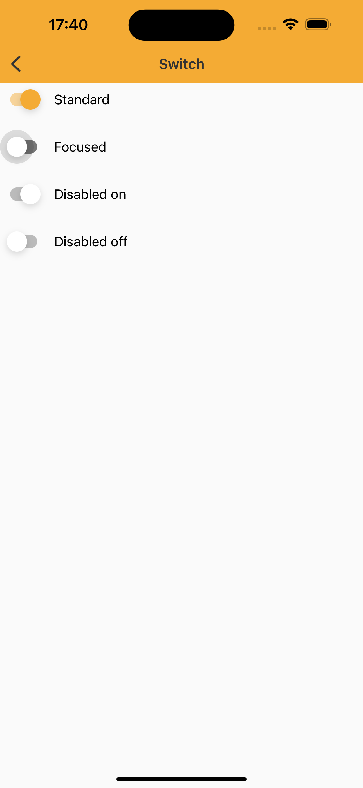

# Switch

> Switches toggle the state of a single item on or off.

## Properties

| Property           | Values                         | Status            |
| --------------     | -------------------------      | ----------------- |
| State             | Enabled, Pressed                          | ✅  Available     |
| Disabled          | True or False   | ✅  Available     |


## Technical Usages Examples

<p align="center">
   
</p>

<br>

```swift
    private let standardSwitch: NatSwitch = {
        let natSwitch = NatSwitch()
        natSwitch.translatesAutoresizingMaskIntoConstraints = false
        return natSwitch
    }()

    private let focusedSwitch: NatSwitch = {
        let natSwitch = NatSwitch(theme: .avonLight)
        natSwitch.configure(state: .focused)
        natSwitch.translatesAutoresizingMaskIntoConstraints = false
        return natSwitch
    }()

    private let disabledOnSwitch: NatSwitch = {
        let natSwitch = NatSwitch()
        natSwitch.configure(state: .disabled)
        natSwitch.configure(isOn: true)
        natSwitch.translatesAutoresizingMaskIntoConstraints = false
        return natSwitch
    }()

    private let disabledOffSwitch: NatSwitch = {
        let natSwitch = NatSwitch()
        natSwitch.configure(state: .disabled)
        natSwitch.configure(isOn: false)
        natSwitch.translatesAutoresizingMaskIntoConstraints = false
        return natSwitch
    }()
```
