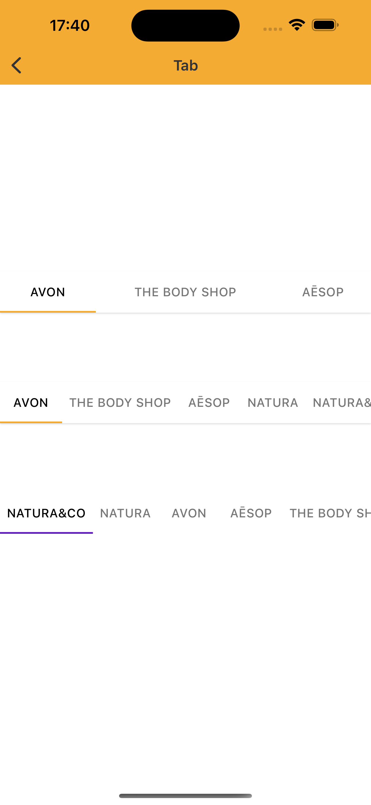

# Tab
> Tabs organize content across different screens, data sets, and other interactions 

## Properties

| Property           | Values                         | Status            |
| --------------     | -------------------------      | ----------------- |
| Position             | Fixed, Scrollable                         | ✅  Available     |
| Icon          | Leading Icon, Top Icon, Icon   | ✅  Available     |
| Interaction State         | Enabled, Press       | ✅  Available     |
| Disabled          | True, False                    | ✅  Available     |
| Elevation          | True, False                    | ✅  Available     |
| Color          | True, False                    | ✅  Available     |


## Technical Usages Examples



<br>

```swift
    private let scrollableTab = Tab()
    private let fixedTab = Tab()
    private let scrollableTabWithoutElevation = Tab(theme: .avonLight)
    
        // Fixed
        addTab(tab: fixedTab)
        fixedTab.delegate = self
        fixedTab.insertTab(title: "AVON")
        fixedTab.insertTab(title: "THE BODY SHOP")
        fixedTab.insertTab(title: "AĒSOP")
        fixedTab.configure(position: .fixed)
        fixedTab.configure(elevation: true)
        // fixedTab.selectedSegmentedIndex = 1

        // Scrollable
        addTab(tab: scrollableTab)
        scrollableTab.delegate = self
        scrollableTab.insertTab(title: "AVON")
        scrollableTab.insertTab(title: "THE BODY SHOP")
        scrollableTab.insertTab(title: "AĒSOP")
        scrollableTab.insertTab(title: "NATURA")
        scrollableTab.insertTab(title: "NATURA&CO")
        scrollableTab.configure(position: .scrollable)
        scrollableTab.configure(elevation: true)
        //scrollableTab.selectedSegmentedIndex = 1
        
        // ScrollableWithoutElevation
        addTab(tab: scrollableTabWithoutElevation)
        scrollableTabWithoutElevation.delegate = self
        scrollableTabWithoutElevation.insertTab(title: "NATURA&CO")
        scrollableTabWithoutElevation.insertTab(title: "NATURA")
        scrollableTabWithoutElevation.insertTab(title: "AVON")
        scrollableTabWithoutElevation.insertTab(title: "AĒSOP")
        scrollableTabWithoutElevation.insertTab(title: "THE BODY SHOP")
        scrollableTabWithoutElevation.configure(position: .scrollable)
        
        private func addTab(tab: Tab) {
        stackView.addArrangedSubview(tab)
        tab.translatesAutoresizingMaskIntoConstraints = false

        NSLayoutConstraint.activate([
            tab.leadingAnchor.constraint(equalTo: stackView.leadingAnchor),
            tab.trailingAnchor.constraint(equalTo: stackView.trailingAnchor)
        ])
        }
```
