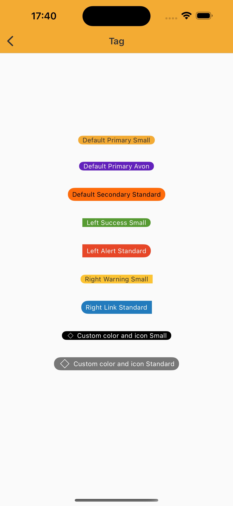

# Tag
> Tags are used to label, categorize, or organize items using keywords that describe them.  

## Properties

| Property           | Values                         | Status            |
| --------------     | -------------------------      | ----------------- |
| Size             | Standard, Small                          | ✅  Available     |
| Color          | Primary, Secondary, Alert, Success, Link, Warning, Custom   | ✅  Available     |
| Position         | Center, Left, Right       | ✅  Available     |
| Icon          | True, False                    | ✅  Available     |


## Technical Usages Examples



<br>


```swift
    private var tagDefaultPrimary: NatTag = {
        let tag = NatTag(style: .defaultAlert)
        tag.configure(text: "Default Primary Small")
        tag.configure(color: .primary)
        tag.configure(size: .small)
        tag.translatesAutoresizingMaskIntoConstraints = false

        return tag
    }()
    
    private var tagCustomDefaultPrimary: NatTag = {
        let tag = NatTag(style: .defaultAlert, theme: .avonLight)
        tag.configure(text: "Default Primary Avon")
        tag.configure(color: .primary)
        tag.configure(size: .small)
        tag.translatesAutoresizingMaskIntoConstraints = false

        return tag
    }()

    private var tagDefaultSecondary: NatTag = {
        let tag = NatTag(style: .defaultAlert)
        tag.configure(text: "Default Secondary Standard")
        tag.configure(color: .secondary)
        tag.configure(size: .standard)
        tag.translatesAutoresizingMaskIntoConstraints = false

        return tag
    }()

    private var tagLeftSuccess: NatTag = {
        let tag = NatTag(style: .leftAlert)
        tag.configure(text: "Left Success Small")
        tag.configure(color: .success)
        tag.configure(size: .small)
        tag.translatesAutoresizingMaskIntoConstraints = false

        return tag
    }()

    private var tagLeftAlert: NatTag = {
        let tag = NatTag(style: .leftAlert)
        tag.configure(text: "Left Alert Standard")
        tag.configure(color: .alert)
        tag.configure(size: .standard)
        tag.translatesAutoresizingMaskIntoConstraints = false

        return tag
    }()

    private var tagRightWarning: NatTag = {
        let tag = NatTag(style: .rightAlert)
        tag.configure(text: "Right Warning Small")
        tag.configure(color: .warning)
        tag.configure(size: .small)
        tag.translatesAutoresizingMaskIntoConstraints = false

        return tag
    }()

    private var tagRightLink: NatTag = {
        let tag = NatTag(style: .rightAlert)
        tag.configure(text: "Right Link Standard")
        tag.configure(color: .link)
        tag.configure(size: .standard)
        tag.translatesAutoresizingMaskIntoConstraints = false

        return tag
    }()

    private var tagDefaultCustom: NatTag = {
        let color: NatTag.Color = .custom(backgroundColor: UIColor.black, labelColor: UIColor.white)
        let tag = NatTag(style: .defaultAlert, color: color, size: .small, icon: getIcon(.outlinedDefaultMockup))
        tag.configure(text: "Custom color and icon Small")
        tag.translatesAutoresizingMaskIntoConstraints = false

        return tag
    }()

    private var tagDefaultStandardCustom: NatTag = {
        let color: NatTag.Color = .custom(backgroundColor: NatColors.mediumEmphasis, labelColor: UIColor.white)
        let tag = NatTag(style: .defaultAlert, color: color, size: .standard, icon: getIcon(.outlinedDefaultMockup))
        tag.configure(text: "Custom color and icon Standard")
        tag.translatesAutoresizingMaskIntoConstraints = false

        return tag
    }()
```
