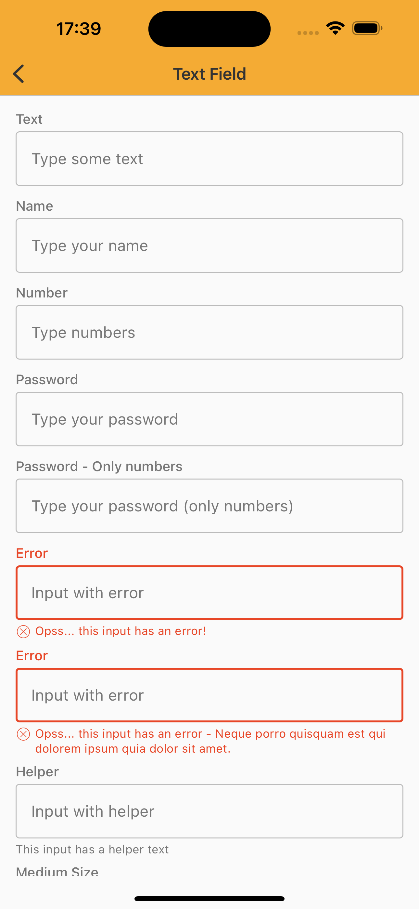
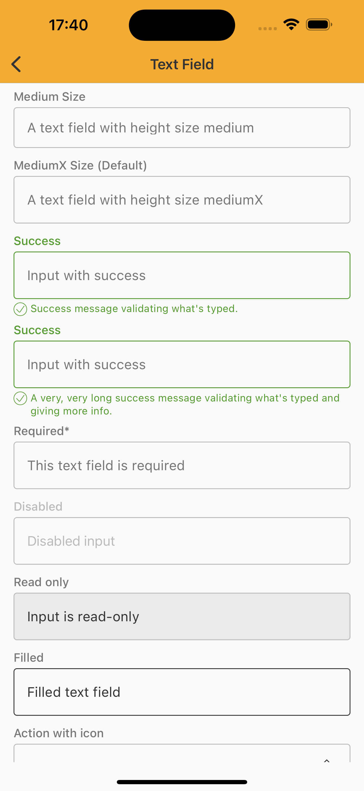
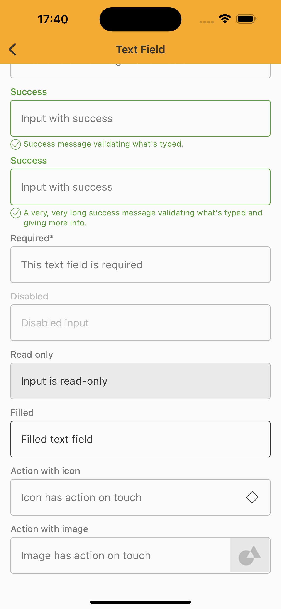

# TextField
> Text fields let users enter and edit text.

<br>

## Properties

| Property           | Values                         | Status            |
| --------------     | -------------------------      | ----------------- |
| Size             | Medium, MediumX                          | ✅  Available     |
| Style          | Outlined   | ✅  Available     |
| States         | Enabled, Active, Filled       | ✅  Available     |
| Feedback          | Error, Success, Required, Disabled, Read-Only,Helper Text                   | ✅  Available     |
| Action               | None, Icon Button, Image           | ✅  Available     |
| Type               | Text, Password, Multi-line, Number           | ✅  Available     |

<br>

## Technical Usages Examples

<p align="center">
   
&nbsp;
  
  &nbsp;
  
</p>

<br>

```swift
    private lazy var textField: TextField = {
        let field = TextField(theme: .avonLight)
        field.title = "Text"
        field.type = .text
        field.placeholder = "Type some text"
        field.delegate = self
        return field
    }()

    private lazy var nameField: TextField = {
        let field = TextField()
        field.title = "Name"
        field.type = .name
        field.placeholder = "Type your name"
        field.delegate = self
        return field
    }()

    private lazy var numberTextField: TextField = {
        let field = TextField()
        field.title = "Number"
        field.type = .number
        field.placeholder = "Type numbers"
        field.delegate = self
        return field
    }()

    private lazy var passwordTextField: TextField = {
        let field = TextField()
        field.title = "Password"
        field.type = .password(keyboardType: .default)
        field.placeholder = "Type your password"
        field.delegate = self
        return field
    }()

    private lazy var numberPasswordTextField: TextField = {
        let field = TextField()
        field.title = "Password - Only numbers"
        field.type = .password(keyboardType: .numberPad)
        field.placeholder = "Type your password (only numbers)"
        field.delegate = self
        return field
    }()

    private lazy var errorTextField: TextField = {
        let field = TextField()
        field.title = "Error"
        field.placeholder = "Input with error"
        field.configure(state: .error, with: "Opss... this input has an error!")
        field.delegate = self
        return field
    }()

    private lazy var errorTextFieldMultpleLines: TextField = {
        let field = TextField()
        field.title = "Error"
        field.placeholder = "Input with error"
        field.configure(state: .error,
                        with: "Opss... this input has an error - Neque porro quisquam est qui dolorem ipsum quia dolor sit amet.")
        field.delegate = self
        return field
    }()

    private lazy var helperTextField: TextField = {
        let field = TextField()
        field.title = "Helper"
        field.placeholder = "Input with helper"
        field.helper = "This input has a helper text"
        field.delegate = self
        return field
    }()

    private lazy var mediumTextField: TextField = {
        let field = TextField()
        field.configure(size: .medium)
        field.title = "Medium Size"
        field.type = .text
        field.placeholder = "A text field with height size medium"
        field.delegate = self
        return field
    }()

    private lazy var mediumXTextField: TextField = {
        let field = TextField()
        field.configure(size: .mediumX)
        field.title = "MediumX Size (Default)"
        field.type = .text
        field.placeholder = "A text field with height size mediumX"
        field.delegate = self
        return field
    }()

    private lazy var successTextField: TextField = {
        let field = TextField()
        field.title = "Success"
        field.type = .text
        field.placeholder = "Input with success"
        field.configure(state: .success, with: "Success message validating what's typed.")
        field.delegate = self
        return field
    }()

    private lazy var longSuccessTextField: TextField = {
        let field = TextField()
        field.title = "Success"
        field.type = .text
        field.placeholder = "Input with success"
        field.configure(state: .success,
                        with: "A very, very long success message validating what's typed and giving more info.")
        field.delegate = self
        return field
    }()

    private lazy var requiredTextField: TextField = {
        let field = TextField()
        field.title = "Required"
        field.type = .text
        field.placeholder = "This text field is required"
        field.configure(required: true)
        field.delegate = self
        return field
    }()

    private lazy var disabledTextField: TextField = {
        let field = TextField()
        field.title = "Disabled"
        field.type = .text
        field.placeholder = "Disabled input"
        field.delegate = self
        field.configure(isEnabled: false)
        return field
    }()

    private lazy var readOnlyTextField: TextField = {
        let field = TextField()
        field.title = "Read only"
        field.type = .text
        field.text = "Input is read-only"
        field.delegate = self
        field.configure(readOnly: true)
        return field
    }()

    private lazy var filledTextField: TextField = {
        let field = TextField()
        field.title = "Filled"
        field.type = .text
        field.text = "Filled text field"
        field.delegate = self
        return field
    }()

    private lazy var actionIconTextField: TextField = {
        let field = TextField()
        field.title = "Action with icon"
        field.type = .text
        field.placeholder = "Icon has action on touch"
        field.configure(iconButton: iconButton)
        field.delegate = self
        return field
    }()

    private lazy var iconButton: NatIconButton = {
        let iconButton = NatIconButton(style: .standardDefault)
        iconButton.configure(icon: getIcon(.outlinedDefaultMockup))
        iconButton.translatesAutoresizingMaskIntoConstraints = false
        iconButton.heightAnchor.constraint(equalToConstant: NatSpacing.semi).isActive = true
        iconButton.widthAnchor.constraint(equalToConstant: NatSpacing.semi).isActive = true
        return iconButton
    }()

    private lazy var actionImageTextField: TextField = {
        let field = TextField()
        field.title = "Action with image"
        field.type = .text
        field.placeholder = "Image has action on touch"
        field.configure(image: UIImage(named: "ImageAreaLimit")) {
            print("That's the image action")
        }
        field.delegate = self
        return field
    }()
```
