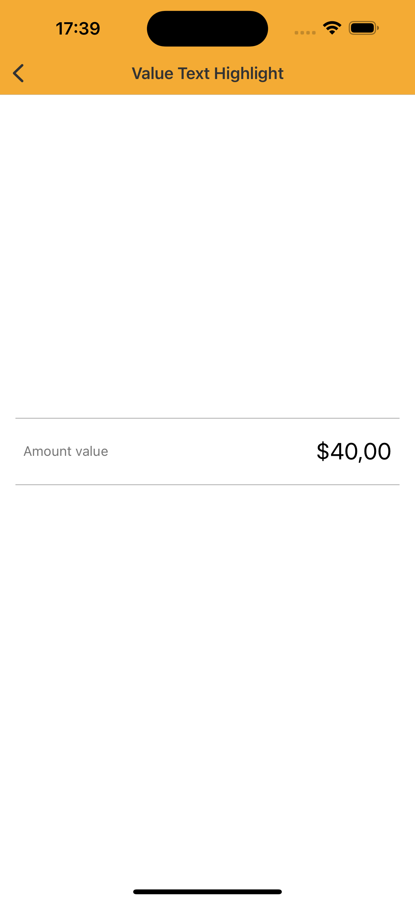

# Value Text Highlight
>  The component Value Text Highlight is deprecated since NatDS version `6.18.0`. 
> ValueTextHighlight is a class that represents a component from the design system.

## Properties

| Property           | Values                         | Status            |
| --------------     | -------------------------      | ----------------- |
| 🚨 Deprecated             | 🚨 Deprecated                         | 🚨 Deprecated    |


## Technical Usages Examples

<p align="center">
   
</p>

<br>

```swift
    let valueTextHighlight = ValueTextHighlight()
    valueTextHighlight.valueDescription = "Amount value"
    valueTextHighlight.value = "$40,00"
```
